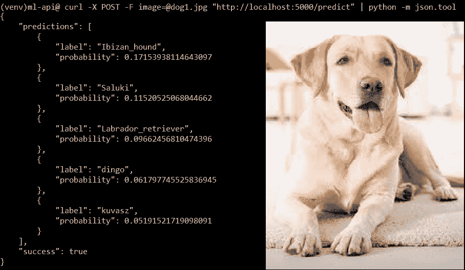

# 将 ML/DL 模型公开为 REST API

> 原文:[https://www . geesforgeks . org/expering-ml-dl-models-as-rest-API/](https://www.geeksforgeeks.org/exposing-ml-dl-models-as-rest-apis/)

在本文中，我们将学习如何将 ML/DL 模型公开为烧瓶 API。

**我们将使用的框架:**
**[Keras](https://keras.io/)** 是一个深度学习库，构建在后端之上，如 Tensorflow、茶诺或 CNTK。它提供了抽象，并允许快速开发 ML/DL 模型。

**[Flask](http://flask.pocoo.org/)** 是 Python 中的一个微 web 框架，用来快速旋转服务器来服务页面。参见[烧瓶介绍](https://www.geeksforgeeks.org/python-introduction-to-web-development-using-flask/)。

由于本文的重点是**使用一个应用编程接口**服务于一个 ML/DL 模型，我们不会更深入地研究卷积模型的制作。我们将使用 **ResNet50** 卷积神经网络。

**安装 Tensorflow 和 Keras**

| **步骤** | Linux/MAC | **窗户** |
| --- | --- | --- |
| 更新 zip | 画中画安装 | python -m pip 安装-U pip |
| --- | --- | --- |
| Install virtualenv | sudo pip install virtualenv | pip install virtualenv |
| --- | --- | --- |
| 创建一个新文件夹 | mkdir ml API & & CD ml API | mkdir ml API & & CD ml API | 创建一个虚拟环境(良好实践)并激活它 | virtualenv–系统-站点-软件包-p python3。/venv | virtualenv–系统-站点-软件包-p python3。/venv | 激活虚拟环境 | 来源。/venv/bin/activate |
| --- | --- | --- | --- | --- | --- | --- | --- |

。\ venv \脚本\激活安装 TensorFlowpip 安装 – 升级张量流pip 安装 – 升级张量流硬安装点安装硬点安装硬安装其他依赖项pip 安装烧瓶 gevent 请求枕头pip install flask gevent requests pillow

**例:**



**创建 REST 应用编程接口:**

```py
# keras_server.py

# Python program to expose a ML model as flask REST API

# import the necessary modules
from keras.applications import ResNet50 # pre-built CNN Model
from keras.preprocessing.image import img_to_array 
from keras.applications import imagenet_utils
import tensorflow as tf
from PIL import Image
import numpy as np
import flask
import io

# Create Flask application and initialize Keras model
app = flask.Flask(__name__)
model = None

# Function to Load the model 
def load_model():

    # global variables, to be used in another function
    global model     
    model = ResNet50(weights ="imagenet")
    global graph 
    graph = tf.get_default_graph()

# Every ML/DL model has a specific format
# of taking input. Before we can predict on
# the input image, we first need to preprocess it.
def prepare_image(image, target):
    if image.mode != "RGB":
        image = image.convert("RGB")

    # Resize the image to the target dimensions
    image = image.resize(target) 

    # PIL Image to Numpy array
    image = img_to_array(image) 

    # Expand the shape of an array,
    # as required by the Model
    image = np.expand_dims(image, axis = 0) 

    # preprocess_input function is meant to
    # adequate your image to the format the model requires
    image = imagenet_utils.preprocess_input(image) 

    # return the processed image
    return image

# Now, we can predict the results.
@app.route("/predict", methods =["POST"])
def predict():
    data = {} # dictionary to store result
    data["success"] = False

    # Check if image was properly sent to our endpoint
    if flask.request.method == "POST":
        if flask.request.files.get("image"):
            image = flask.request.files["image"].read()
            image = Image.open(io.BytesIO(image))

            # Resize it to 224x224 pixels 
            # (required input dimensions for ResNet)
            image = prepare_image(image, target =(224, 224))

        # Predict ! global preds, results
            with graph.as_default():
                preds = model.predict(image)
                results = imagenet_utils.decode_predictions(preds)
                data["predictions"] = []

            for (ID, label, probability) in results[0]:
                r = {"label": label, "probability": float(probability)}
                data["predictions"].append(r)

            data["success"] = True

    # return JSON response
    return flask.jsonify(data)

if __name__ == "__main__":
    print(("* Loading Keras model and Flask starting server..."
        "please wait until server has fully started"))
    load_model()
    app.run()
```

**运行烧瓶服务器**

```py
python keras_server.py 
```

**注#1:** 第一次运行，需要时间下载模型的权重。在随后的运行中，情况不会如此。
**注 2:** 将图像保存在同一目录(ml-API)–dog.jpg、cat.jpg、lion.jpg。

### 向服务器发出请求:

**方法#1 :** **使用 cURL** (从[这里](https://curl.haxx.se/windows/)下载 Windows 的 cURL。)

```py
$ curl -X POST -F image=@dog.jpg "http://localhost:5000/predict"
```

**方法 2 :** (如果做一个全栈网络应用程序，用合适的用户界面就合适了)
创建一个简单的 HTML 表单

```py
<!-- index.html -->
<form action = "http://localhost:5000/predict" method = "POST" 
         enctype = "multipart/form-data">
         <input type = "file" name = "image" />
         <input type = "submit"/>
</form>
```

**方法#3 :** 创建一个简单的 python 脚本，向 flask 服务器发出 HTTP 请求。

```py
# simple_request.py
import requests
import sys

URL = "http://localhost:5000/predict"

# provide image name as command line argument
IMAGE_PATH = sys.argv[1] 

image = open(IMAGE_PATH, "rb").read()
payload = {"image": image}

# make request to the API
request = requests.post(URL, files = payload).json()

if request["success"]:
    # Print formatted Result
    print("% s % 15s % s"%("Rank", "Label", "Probability"))
    for (i, result) in enumerate(request["predictions"]):
        print("% d.    % 17s %.4f"%(i + 1, result["label"],
            result["probability"]))

    else:
        print("Request failed")
```

**运行为:**

```py
python simple_request.py dog.jpg
```

**输出:**


完成后要停用(Windows 和 Linux):

```py
> deactivate

```

因此，一般来说，任何模型的工作流程都是

*   建立模型并保存。
*   创建一个烧瓶应用程序。
*   加载模型
*   为每种类型的请求定义应用编程接口的端点。
*   根据模型的体系结构对输入进行预处理，并将其提供给模型
*   处理输入并将输出发送回客户端。