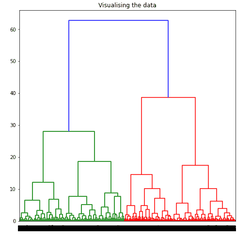
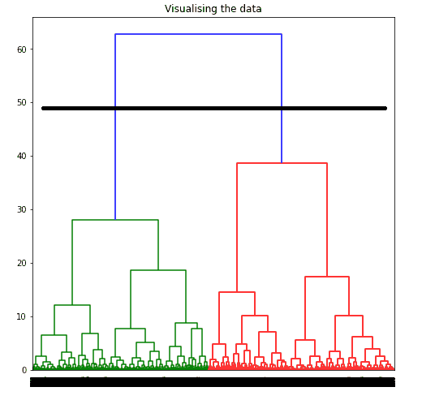
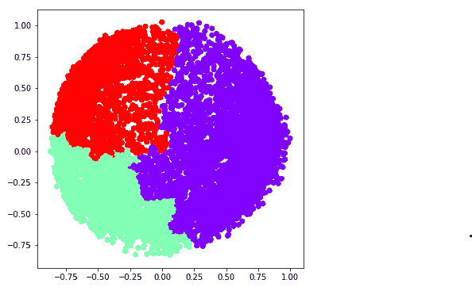
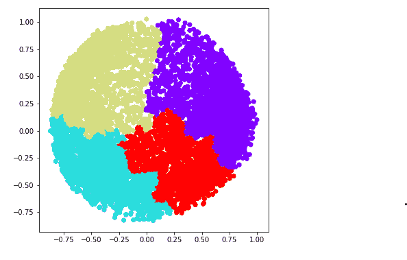
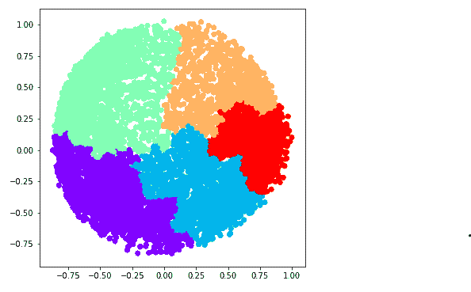
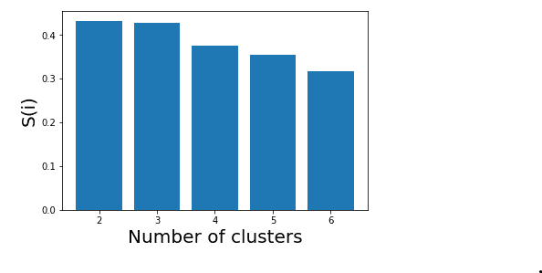

# 使用 Sklearn

实现聚集聚类

> 原文:[https://www . geeksforgeeks . org/impering-aggregate-clustering-using-sklearn/](https://www.geeksforgeeks.org/implementing-agglomerative-clustering-using-sklearn/)

**先决条件:** [凝聚聚类](https://www.geeksforgeeks.org/ml-hierarchical-clustering-agglomerative-and-divisive-clustering/)
凝聚聚类是最常见的层次聚类技术之一。
数据集–[信用卡数据集](https://www.kaggle.com/arjunbhasin2013/ccdata)。

**假设:**聚类技术假设每个数据点与其他数据点足够相似，可以假设起始处的数据被聚类在 1 个聚类中。

**步骤 1:导入所需的库**

```
import pandas as pd
import numpy as np
import matplotlib.pyplot as plt
from sklearn.decomposition import PCA
from sklearn.cluster import AgglomerativeClustering
from sklearn.preprocessing import StandardScaler, normalize
from sklearn.metrics import silhouette_score
import scipy.cluster.hierarchy as shc
```

**第二步:加载和清理数据**

```
# Changing the working location to the location of the file
cd C:\Users\Dev\Desktop\Kaggle\Credit_Card

X = pd.read_csv('CC_GENERAL.csv')

# Dropping the CUST_ID column from the data
X = X.drop('CUST_ID', axis = 1)

# Handling the missing values
X.fillna(method ='ffill', inplace = True)
```

**第三步:数据预处理**

```
# Scaling the data so that all the features become comparable
scaler = StandardScaler()
X_scaled = scaler.fit_transform(X)

# Normalizing the data so that the data approximately 
# follows a Gaussian distribution
X_normalized = normalize(X_scaled)

# Converting the numpy array into a pandas DataFrame
X_normalized = pd.DataFrame(X_normalized)
```

**第四步:降低数据的维度**

```
pca = PCA(n_components = 2)
X_principal = pca.fit_transform(X_normalized)
X_principal = pd.DataFrame(X_principal)
X_principal.columns = ['P1', 'P2']
```

**树突图**用于将给定的簇划分为许多不同的簇。

**第五步:可视化树突的工作**

```
plt.figure(figsize =(8, 8))
plt.title('Visualising the data')
Dendrogram = shc.dendrogram((shc.linkage(X_principal, method ='ward')))
```



要通过可视化数据来确定最佳聚类数，请将所有水平线想象为完全水平，然后在计算任意两条水平线之间的最大距离后，在计算的最大距离中绘制一条水平线。



上图显示，对于给定的数据，最佳聚类数应为 2。

**第六步:为不同的 k 值建立和可视化不同的聚类模型**

a) **k = 2**

```
ac2 = AgglomerativeClustering(n_clusters = 2)

# Visualizing the clustering
plt.figure(figsize =(6, 6))
plt.scatter(X_principal['P1'], X_principal['P2'], 
           c = ac2.fit_predict(X_principal), cmap ='rainbow')
plt.show()
```


b) **k = 3**

```
ac3 = AgglomerativeClustering(n_clusters = 3)

plt.figure(figsize =(6, 6))
plt.scatter(X_principal['P1'], X_principal['P2'],
           c = ac3.fit_predict(X_principal), cmap ='rainbow')
plt.show()
```



c) **k = 4**

```
ac4 = AgglomerativeClustering(n_clusters = 4)

plt.figure(figsize =(6, 6))
plt.scatter(X_principal['P1'], X_principal['P2'],
            c = ac4.fit_predict(X_principal), cmap ='rainbow')
plt.show()
```



d) **k = 5**

```
ac5 = AgglomerativeClustering(n_clusters = 5)

plt.figure(figsize =(6, 6))
plt.scatter(X_principal['P1'], X_principal['P2'],
            c = ac5.fit_predict(X_principal), cmap ='rainbow')
plt.show()
```



e) **k = 6**

```
ac6 = AgglomerativeClustering(n_clusters = 6)

plt.figure(figsize =(6, 6))
plt.scatter(X_principal['P1'], X_principal['P2'],
            c = ac6.fit_predict(X_principal), cmap ='rainbow')
plt.show()
```


我们现在使用数学技术来确定最佳的集群数量。在这里，我们将使用**轮廓分数**作为目的。

**步骤 7:评估不同的模型并可视化结果。**

```
k = [2, 3, 4, 5, 6]

# Appending the silhouette scores of the different models to the list
silhouette_scores = []
silhouette_scores.append(
        silhouette_score(X_principal, ac2.fit_predict(X_principal)))
silhouette_scores.append(
        silhouette_score(X_principal, ac3.fit_predict(X_principal)))
silhouette_scores.append(
        silhouette_score(X_principal, ac4.fit_predict(X_principal)))
silhouette_scores.append(
        silhouette_score(X_principal, ac5.fit_predict(X_principal)))
silhouette_scores.append(
        silhouette_score(X_principal, ac6.fit_predict(X_principal)))

# Plotting a bar graph to compare the results
plt.bar(k, silhouette_scores)
plt.xlabel('Number of clusters', fontsize = 20)
plt.ylabel('S(i)', fontsize = 20)
plt.show()
```



因此，借助于轮廓分数，可以得出结论，对于给定的数据和聚类技术，最佳聚类数是 2。