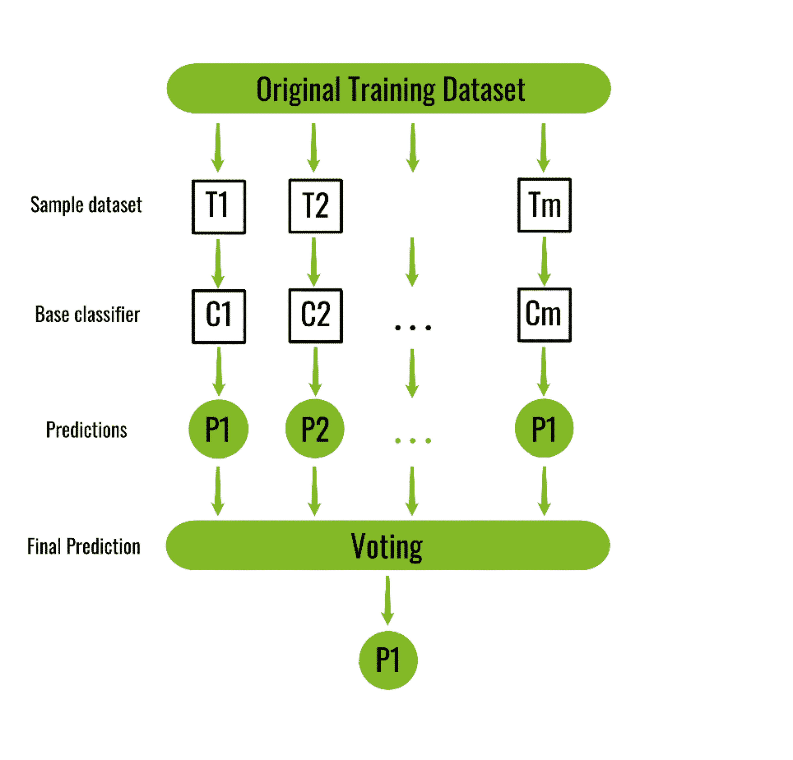

# ML |装袋分级机

> 原文:[https://www.geeksforgeeks.org/ml-bagging-classifier/](https://www.geeksforgeeks.org/ml-bagging-classifier/)

Bagging 分类器是一个集成元估计器，它将每个基础分类器放在原始数据集的随机子集上，然后聚合它们各自的预测(通过投票或平均)来形成最终预测。这种元估计器通常可以用作一种方式，通过在其构造过程中引入随机化，然后从中进行集成，来减少黑盒估计器(例如决策树)的方差。
每个基本分类器与一个训练集并行训练，该训练集通过从原始训练数据集–*随机抽取 N 个示例(或数据)进行替换而生成，其中 N 是原始训练集的大小*。每个基本分类器的训练集彼此独立。许多原始数据可能会在结果训练集中重复，而其他数据可能会被遗漏。

装袋通过求平均值或投票来减少过度拟合(方差)，然而，这会导致偏差的增加，而偏差的减少会补偿偏差的增加。

【Bagging 在训练数据集上是如何工作的？
下图显示了 bagging 如何在假想的训练数据集上工作。由于 Bagging 通过替换对原始训练数据集进行重新采样，因此某些实例(或数据)可能会出现多次，而其他实例则被忽略。

> **原始训练数据集:** 1、2、3、4、5、6、7、8、9、10
> 
> **重采样训练集 1:** 2、3、3、5、6、1、8、10、9、1
> **重采样训练集 2:** 1、1、5、6、3、8、9、10、2、7
> **重采样训练集 3:** 1、5、8、9、2、10、9、7、5、4

Bagging 分类器的算法:

```py
*Classifier generation:*

Let N be the size of the training set.
for each of t iterations:
    sample N instances with replacement from the original training set.
    apply the learning algorithm to the sample.
    store the resulting classifier.

*Classification:*
for each of the t classifiers:
    predict class of instance using classifier.
return class that was predicted most often.

```



下面是上面算法的 Python 实现:

```py
from sklearn import model_selection
from sklearn.ensemble import BaggingClassifier
from sklearn.tree import DecisionTreeClassifier
import pandas as pd

# load the data
url = "/home/debomit/Downloads/wine_data.xlsx"
dataframe = pd.read_excel(url)
arr = dataframe.values
X = arr[:, 1:14]
Y = arr[:, 0]

seed = 8
kfold = model_selection.KFold(n_splits = 3,
                       random_state = seed)

# initialize the base classifier
base_cls = DecisionTreeClassifier()

# no. of base classifier
num_trees = 500

# bagging classifier
model = BaggingClassifier(base_estimator = base_cls,
                          n_estimators = num_trees,
                          random_state = seed)

results = model_selection.cross_val_score(model, X, Y, cv = kfold)
print("accuracy :")
print(results.mean())
```

**输出:**

```py
accuracy :
0.8372093023255814

```