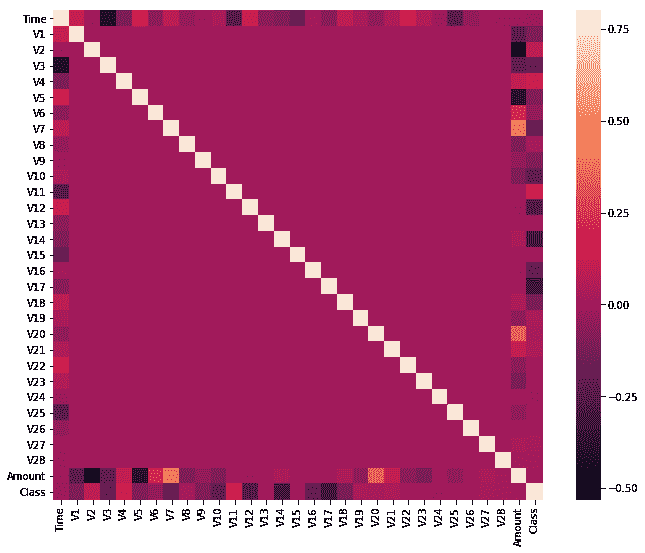
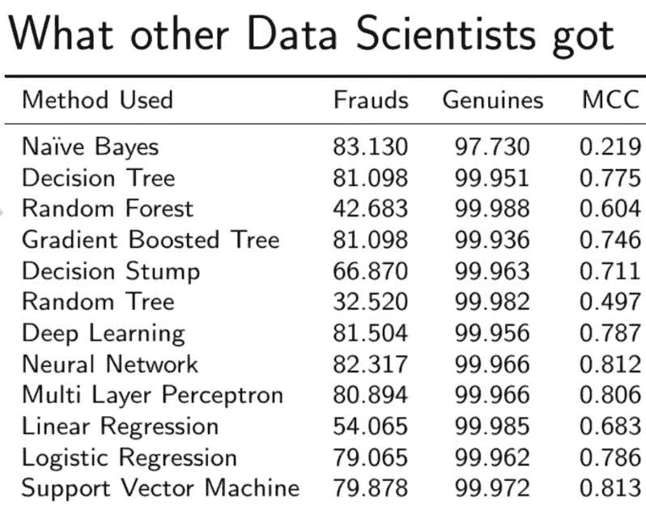

# ML |信用卡诈骗检测

> 原文:[https://www . geesforgeks . org/ml-信用卡-欺诈-检测/](https://www.geeksforgeeks.org/ml-credit-card-fraud-detection/)

面临的挑战是识别欺诈性信用卡交易，以便信用卡公司的客户不会因为他们没有购买的物品而被收取费用。

**信用卡诈骗检测涉及的主要挑战有:**

1.  每天都有大量的数据被处理，模型构建必须足够快，以便及时响应骗局。
2.  不平衡数据，即大多数交易 *(99.8%)* 不是欺诈性的，这使得检测欺诈性交易变得非常困难
3.  数据可用性，因为数据大多是私有的。
4.  错误分类的数据可能是另一个主要问题，因为并非每个欺诈交易都会被捕获和报告。
5.  诈骗者针对模型使用的自适应技术。

**如何应对这些挑战？**

1.  所使用的模型必须足够简单和快速，以检测异常并尽快将其归类为欺诈交易。
2.  不平衡可以通过适当使用一些方法来解决，我们将在下一段中讨论这些方法
3.  为了保护用户的隐私，可以降低数据的维度。
4.  至少在训练模型时，必须采用一个更值得信赖的来源来反复检查数据。
5.  我们可以使模型变得简单和可解释，这样当骗子只需稍加调整就能适应它时，我们就可以启动并运行一个新模型来部署。

在进入代码之前，需要在 jupyter 笔记本上工作。如果没有安装在你的机器上，你可以使用[谷歌可乐](https://colab.research.google.com/)。
可以从[这个链接](https://www.kaggle.com/mlg-ulb/creditcardfraud/download)T5 下载数据集，如果链接不工作请转到[这个](https://www.kaggle.com/mlg-ulb/creditcardfraud)链接登录 kaggle 下载数据集。
**代码:导入所有必要的库**

```
# import the necessary packages
import numpy as np
import pandas as pd
import matplotlib.pyplot as plt
import seaborn as sns
from matplotlib import gridspec
```

**代码:加载数据**

```
# Load the dataset from the csv file using pandas
# best way is to mount the drive on colab and 
# copy the path for the csv file
data = pd.read_csv("credit.csv")
```

**代码:理解数据**

```
# Grab a peek at the data
data.head()
```


**代码:描述数据**

```
# Print the shape of the data
# data = data.sample(frac = 0.1, random_state = 48)
print(data.shape)
print(data.describe())
```

**输出:**

```
(284807, 31)
                Time            V1  ...         Amount          Class
count  284807.000000  2.848070e+05  ...  284807.000000  284807.000000
mean    94813.859575  3.919560e-15  ...      88.349619       0.001727
std     47488.145955  1.958696e+00  ...     250.120109       0.041527
min         0.000000 -5.640751e+01  ...       0.000000       0.000000
25%     54201.500000 -9.203734e-01  ...       5.600000       0.000000
50%     84692.000000  1.810880e-02  ...      22.000000       0.000000
75%    139320.500000  1.315642e+00  ...      77.165000       0.000000
max    172792.000000  2.454930e+00  ...   25691.160000       1.000000

[8 rows x 31 columns]

```

**代码:数据不平衡**
时间来解释我们正在处理的数据。

```
# Determine number of fraud cases in dataset
fraud = data[data['Class'] == 1]
valid = data[data['Class'] == 0]
outlierFraction = len(fraud)/float(len(valid))
print(outlierFraction)
print('Fraud Cases: {}'.format(len(data[data['Class'] == 1])))
print('Valid Transactions: {}'.format(len(data[data['Class'] == 0])))
```


仅 *0.17%* 欺诈交易出全部交易。数据非常不平衡。让我们首先应用我们的模型，而不进行平衡，如果我们不能获得良好的精度，那么我们可以找到一种方法来平衡这个数据集。但是首先，让我们在没有模型的情况下实现模型，并且仅在需要时平衡数据。

**编码:打印欺诈交易金额明细**

```
print(“Amount details of the fraudulent transaction”)
fraud.Amount.describe()
```

**输出:**

```
Amount details of the fraudulent transaction
count     492.000000
mean      122.211321
std       256.683288
min         0.000000
25%         1.000000
50%         9.250000
75%       105.890000
max      2125.870000
Name: Amount, dtype: float64

```

**编码:打印正常交易的金额明细**

```
print(“details of valid transaction”)
valid.Amount.describe()
```

**输出:**

```
Amount details of valid transaction
count    284315.000000
mean         88.291022
std         250.105092
min           0.000000
25%           5.650000
50%          22.000000
75%          77.050000
max       25691.160000
Name: Amount, dtype: float64

```

由此我们可以清楚地注意到，欺诈性交易的平均货币交易量更多。这使得这个问题变得至关重要。

**代码:绘制相关矩阵**
相关矩阵以图形方式让我们了解特征之间是如何相互关联的，并且可以帮助我们预测哪些特征与预测最相关。

```
# Correlation matrix
corrmat = data.corr()
fig = plt.figure(figsize = (12, 9))
sns.heatmap(corrmat, vmax = .8, square = True)
plt.show()
```


在热图中，我们可以清楚地看到，大多数特征与其他特征不相关，但有一些特征彼此之间存在正相关或负相关。例如， *V2* 和 *V5* 与被称为*数量*的特征高度负相关。我们也看到了与 *V20* 和*数量*的一些相关性。这让我们对可用数据有了更深入的了解。

**代码:分离 X 和 Y 值**
将数据分为输入参数和输出值格式

```
# dividing the X and the Y from the dataset
X = data.drop(['Class'], axis = 1)
Y = data["Class"]
print(X.shape)
print(Y.shape)
# getting just the values for the sake of processing 
# (its a numpy array with no columns)
xData = X.values
yData = Y.values
```

**输出:**

```

(284807, 30)
(284807, )
```

 **训练和测试数据分叉**
我们将数据集分为两个主要组。一个用于训练模型，另一个用于测试我们训练的模型的性能。

```
# Using Skicit-learn to split data into training and testing sets
from sklearn.model_selection import train_test_split
# Split the data into training and testing sets
xTrain, xTest, yTrain, yTest = train_test_split(
        xData, yData, test_size = 0.2, random_state = 42)
```

**代码:使用 skicit learn 构建随机森林模型**

```
# Building the Random Forest Classifier (RANDOM FOREST)
from sklearn.ensemble import RandomForestClassifier
# random forest model creation
rfc = RandomForestClassifier()
rfc.fit(xTrain, yTrain)
# predictions
yPred = rfc.predict(xTest)
```

**代码:建立各种评估参数**

```
# Evaluating the classifier
# printing every score of the classifier
# scoring in anything
from sklearn.metrics import classification_report, accuracy_score 
from sklearn.metrics import precision_score, recall_score
from sklearn.metrics import f1_score, matthews_corrcoef
from sklearn.metrics import confusion_matrix

n_outliers = len(fraud)
n_errors = (yPred != yTest).sum()
print("The model used is Random Forest classifier")

acc = accuracy_score(yTest, yPred)
print("The accuracy is {}".format(acc))

prec = precision_score(yTest, yPred)
print("The precision is {}".format(prec))

rec = recall_score(yTest, yPred)
print("The recall is {}".format(rec))

f1 = f1_score(yTest, yPred)
print("The F1-Score is {}".format(f1))

MCC = matthews_corrcoef(yTest, yPred)
print("The Matthews correlation coefficient is{}".format(MCC))
```

**输出:**

```
The model used is Random Forest classifier
The accuracy is  0.9995611109160493
The precision is 0.9866666666666667
The recall is 0.7551020408163265
The F1-Score is 0.8554913294797689
The Matthews correlation coefficient is0.8629589216367891

```

**代码:可视化混淆矩阵**

```
# printing the confusion matrix
LABELS = ['Normal', 'Fraud']
conf_matrix = confusion_matrix(yTest, yPred)
plt.figure(figsize =(12, 12))
sns.heatmap(conf_matrix, xticklabels = LABELS, 
            yticklabels = LABELS, annot = True, fmt ="d");
plt.title("Confusion matrix")
plt.ylabel('True class')
plt.xlabel('Predicted class')
plt.show()
```

**输出:**

在不处理数据不平衡的情况下与其他算法进行比较。


正如你可以看到我们的随机森林模型，我们正在得到一个更好的结果，即使是召回，这是最棘手的部分。