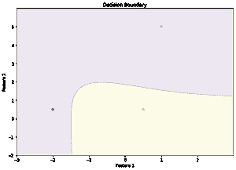

# ML–决策功能

> 原文:[https://www.geeksforgeeks.org/ml-decision-function/](https://www.geeksforgeeks.org/ml-decision-function/)

决策函数是 sklearn 机器学习框架的分类器类中的一种方法。这个方法基本上返回一个 Numpy 数组，其中每个元素表示分类器对 x_test 的预测样本是位于超平面的右侧还是左侧，以及离超平面有多远。

它还告诉我们分类器为 x_test 预测的每个值是正的(大幅度正值)还是负的(大幅度负值)是多么有把握。

**决策函数法背后的数学:**
我们来考虑一下 SVM 对于线性可分二元类的分类问题:

**成本函数:**

<center>
![ \left.\min _{\theta} C \sum_{i=1}^{m}\left[u^{(0)} \operatorname{cost}_{1}\left(\theta^{T} x^{(\theta)}\right)+\left(1-y^{(0)}\right) \operatorname{cost}_{0}\left(\theta^{T} x^{(0)}\right)\right]+\frac{1}{2} \sum_{i=1}^{n} \theta\right\}](img/e3700a75a8f368bb156746a6ed2a6268.png "Rendered by QuickLaTeX.com")</center>

**这个线性可分二元分类的假设:**

<center>
</center>

The **optimization Algorithm** minimizes the cost function to find the best value of the model parameter for the hypothesis such that:

<center>
</center>

**当我们将数据实例传递给决策函数方法时，实际上会发生什么？**
这个数据样本在这个假设中被替换，这个假设的模型参数是通过最小化成本函数找到的，并且返回这个假设输出的值，如果实际输出是 1，这个值将是> 1，或者如果实际输出是 0，< -1。这个返回值确实代表了超平面的哪一侧，以及给定的数据样本离它有多远。

**代码:创建我们自己的数据集并绘制输入。**

```py
# This code may not run on GFG IDE
# As required modules are not available.

# Create a simple data set
# Binary-Class Classification.

# Import Required Modules.
import matplotlib.pyplot as plt
import numpy as np

# Input Feature X.
x = np.array([[2, 1.5], [-2, -1], [-1, -1], [2, 1],
              [1, 5], [0.5, 0.5], [-2, 0.5]])

# Input Feature Y.
y = np.array([0, 0, 1, 1, 1, 1, 0])

# Training set Featute x_train.
x_train = np.array([[2, 1.5], [-2, -1], [-1, -1], [2, 1]])

# Training set Target Variable y_train.
y_train = np.array([0, 0, 1, 1])

# Test set Featute x_test.
x_test = np.array([[1, 5], [0.5, 0.5], [-2, 0.5]])

# Test set Target Variable y_test
y_test = np.array([1, 1, 0])

# Plot the obtained data
plt.scatter(x[:, 0], x[:, 1], c = y)
plt.xlabel('Feature 1 --->')
plt.ylabel('Feature 2 --->')
plt.title('Created Data')
```

**输出:**

<center></center>

**代码:训练我们的模型**

```py
# This code may not run on GFG IDE
# As required modules are not available.

# Import SVM Class from sklearn.
from sklearn.svm import SVC
clf = SVC()

# Train the model on the training set.
clf.fit(x_train, y_train) 

# Predict on Test set
predict = clf.predict(x_test)
print('Predicted Values from Classifier:', predict)
print('Actual Output is:', y_test)
print('Accuracy of the model is:', clf.score(x_test, y_test))
```

**输出:**

```py
Predicted Values from Classifier: [0 1 0]
Actual Output is: [1 1 0]
Accuracy of the model is: 0.6666666666666666

```

**代码:决策函数法**

```py
# This code may not run on GFG IDE
# As required modules are not available.

# Using Decision Function Method Present in svc class
Decision_Function = clf.decision_function(x_test)
print('Output of Decision Function is:', Decision_Function)
print('Prediction for x_test from classifier is:', predict)
```

**输出:**

```py
Output of Decision Function is: [-0.04274893  0.29143233 -0.13001369]
Prediction for x_test from classifier is: [0 1 0]

```

从上面的输出，我们可以得出结论，决策函数输出表示分类器对 x_test 的预测样本是位于超平面的右侧还是左侧，以及离它有多远。它还告诉我们分类器为 x_test 预测的每个值是正的(大幅度正值)还是负的(大幅度负值)

**代码:决策边界**

```py
# This code may not run on GFG IDE
# As required modules are not available.

# To Plot the Decision Boundary.
arr1 = np.arange(x[:, 0].min()-1, x[:, 0].max()+1, 0.01)
arr2 = np.arange(x[:, 1].min()-1, x[:, 1].max()+1, 0.01)

xx, yy = np.meshgrid(arr1, arr2)
input_array = np.array([xx.ravel(), yy.ravel()]).T
labels = clf.predict(input_array)

plt.figure(figsize =(10, 7))
plt.contourf(xx, yy, labels.reshape(xx.shape), alpha = 0.1)
plt.scatter(x_test[:, 0], x_test[:, 1], c = y_test.ravel(), alpha = 1)
plt.xlabel('Feature 1')
plt.ylabel('Feature 2')
plt.title('Decision Boundary')
```

让我们想象一下上面的结论。

<center>
The advantage of Decision Function output is to set DECISION THRESHOLD and predict a new output for x_test, such that we get desired precision or recall value If our project is precision-oriented or recall-oriented respectively.</center>