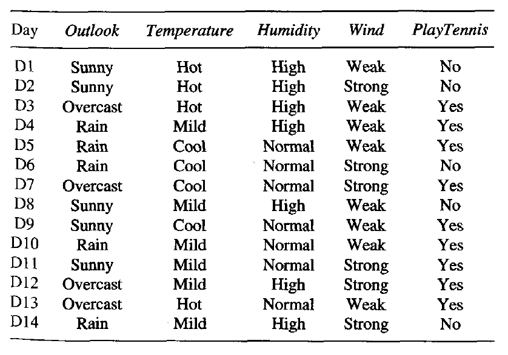

# ML |用于特征选择的额外树分类器

> 原文:[https://www . geeksforgeeks . org/ml-额外树-特征选择分类器/](https://www.geeksforgeeks.org/ml-extra-tree-classifier-for-feature-selection/)

**先决条件:** [决策树分类器](https://www.geeksforgeeks.org/decision-tree-introduction-example/)

**极随机树分类器(Extra Trees Classifier)** 是一种集成学习技术，它聚合在一个“森林”中收集的多个去相关决策树的结果，以输出其分类结果。在概念上，它非常类似于随机森林分类器，只是在构建森林中的决策树的方式上有所不同。

额外树森林中的每个决策树都是从原始训练样本构建的。然后，在每个测试节点，每个树都被提供有来自特征集中的 k 个特征的随机样本，每个决策树必须从该样本中选择最佳特征，以基于一些数学标准(通常是基尼指数)分割数据。这种特征的随机样本导致多个去相关决策树的产生。

为了使用上述森林结构执行特征选择，在构建森林期间，对于每个特征，计算在分割特征的决策中使用的数学标准中的归一化总减少量(如果在构建森林中使用基尼指数，则为基尼指数)。这个值被称为特征的吉尼重要性。为了执行特征选择，每个特征根据每个特征的基尼重要性以降序排列，并且用户根据他/她的选择选择前 k 个特征。

考虑以下数据:-



让我们为上面的数据建立一个假设的额外树森林，它有**五棵决策树**，k 的值决定了特征随机样本中的特征数量是**两个**。这里使用的决策标准是信息增益。首先，我们计算数据的熵。注意计算熵的公式是:-

<center></center>

其中 c 为唯一类标签数，为输出标签为 I 的行的比例。

因此，对于给定的数据，**熵**为:-


让决策树的构造如下

*   **1st Decision Tree gets data with the features Outlook and Temperature:**

    请注意，信息增益的公式为:-

    

    因此，

    同样地:

    *   **2nd Decision Tree gets data with the features Temperature and Wind:**

    使用上面给出的公式:-

    *   strong >第三个决策树获取具有 Outlook 和湿度功能的数据:*   **第四决策树获取具有温度和湿度特征的数据:***   **第五决策树获取具有风和湿度特征的数据:**

计算每个功能的总信息增益:-

```
 Total Info Gain for Outlook     =     0.246+0.246   = 0.492

Total Info Gain for Temperature = 0.029+0.029+0.029 = 0.087

Total Info Gain for Humidity    = 0.151+0.151+0.151 = 0.453

Total Info Gain for Wind        =     0.048+0.048   = 0.096 

```

因此，根据上面构建的额外树木森林来确定输出标签的最重要的变量是特征“前景”。

下面给出的代码将演示如何使用额外的树分类器进行特征选择。

**步骤 1:导入所需的库**

```
import pandas as pd
import numpy as np
import matplotlib.pyplot as plt
from sklearn.ensemble import ExtraTreesClassifier
```

**第二步:加载和清理数据**

```
# Changing the working location to the location of the file
cd C:\Users\Dev\Desktop\Kaggle

# Loading the data
df = pd.read_csv('data.csv')

# Separating the dependent and independent variables
y = df['Play Tennis']
X = df.drop('Play Tennis', axis = 1)

X.head()
```


**步骤 3:建立额外树木森林并计算个体特征重要性**

```
# Building the model
extra_tree_forest = ExtraTreesClassifier(n_estimators = 5,
                                        criterion ='entropy', max_features = 2)

# Training the model
extra_tree_forest.fit(X, y)

# Computing the importance of each feature
feature_importance = extra_tree_forest.feature_importances_

# Normalizing the individual importances
feature_importance_normalized = np.std([tree.feature_importances_ for tree in 
                                        extra_tree_forest.estimators_],
                                        axis = 0)
```

**第四步:可视化和比较结果**

```
# Plotting a Bar Graph to compare the models
plt.bar(X.columns, feature_importance_normalized)
plt.xlabel('Feature Labels')
plt.ylabel('Feature Importances')
plt.title('Comparison of different Feature Importances')
plt.show()
```

<center></center>

因此，上面给出的输出验证了我们关于使用额外树分类器进行特征选择的理论。由于特征样本的随机性，特征的重要性可能有不同的值。