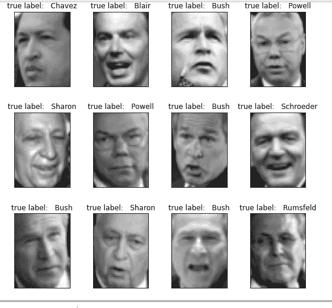
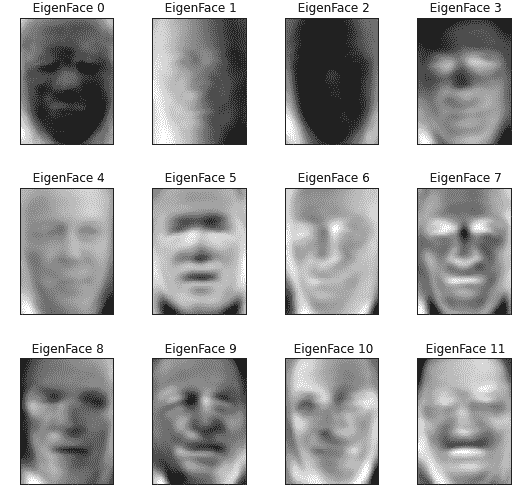
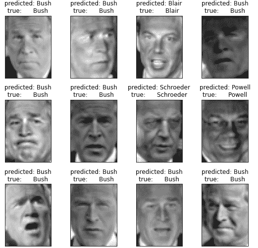

# ML |使用 PCA 实现的人脸识别

> 原文:[https://www . geesforgeks . org/ml-人脸识别-使用-PCA-实现/](https://www.geeksforgeeks.org/ml-face-recognition-using-pca-implementation/)

人脸识别是计算机视觉中最受欢迎和最有争议的任务之一。最重要的里程碑之一是使用这种方法实现的。这种方法最早是由西罗维奇和科比在 1987 年开发的，最早是由特克和亚历克斯·彭特兰在 1991 年用于人脸分类。它易于实现，因此用于许多早期的人脸识别应用。但它也有一些警告，比如这种算法要求裁剪后的人脸图像具有适当的光线和姿势进行训练。在本文中，我们将讨论这个方法在 python 和 sklearn 中的实现。
我们需要首先导入 scikit-learn 库，以便使用这个库中提供的 PCA 函数 API。
scikit-learn 库还提供了一个获取 ***LFW_peoples*** 数据集的 API。我们还要求 matplotlib 绘制人脸。
**代码:导入库**

## 蟒蛇 3

```py
# Import matplotlib library
import matplotlib.pyplot as plt

# Import scikit-learn library
from sklearn.model_selection import train_test_split
from sklearn.model_selection import GridSearchCV
from sklearn.datasets import fetch_lfw_people
from sklearn.metrics import classification_report
from sklearn.metrics import confusion_matrix
from sklearn.decomposition import PCA
from sklearn.svm import SVC

import numpy as np
```

现在我们使用 sklearn 的 fetch_lfw_people 函数 API 导入 LFW_people 数据集。LFW prople 是 LFW 的预处理摘录。包含 *5749* 类 *125 * 94* 的 *13233* 图像。该功能提供了一个参数*min _ face _ per _ person*。这个参数允许我们选择每个人至少有 min _ faces _ 不同图片的类。该功能还有一个参数*调整*的大小，该参数调整提取的人脸中的每个图像的大小。我们使用*min _ face _ per _ person = 70*和 *resize = 0.4* 。
**代码:**

## 蟒蛇 3

```py
# this command will download the LFW_people's dataset to hard disk.
lfw_people = fetch_lfw_people(min_faces_per_person = 70, resize = 0.4)

# introspect the images arrays to find the shapes (for plotting)
n_samples, h, w = lfw_people.images.shape

# Instead of providing 2D data, X has data already in the form  of a vector that
# is required in this approach.
X = lfw_people.data
n_features = X.shape[1]

# the label to predict is the id of the person
y = lfw_people.target
target_names = lfw_people.target_names
n_classes = target_names.shape[0]

# Print Details about dataset
print("Number of Data Samples: % d" % n_samples)
print("Size of a data sample: % d" % n_features)
print("Number of Class Labels: % d" % n_classes)
```

**输出:**


**代码:数据探索**

## 蟒蛇 3

```py
# Function to plot images in 3 * 4 
def plot_gallery(images, titles, h, w, n_row = 3, n_col = 4):
    plt.figure(figsize =(1.8 * n_col, 2.4 * n_row))
    plt.subplots_adjust(bottom = 0, left =.01, right =.99, top =.90, hspace =.35)
    for i in range(n_row * n_col):
        plt.subplot(n_row, n_col, i + 1)
        plt.imshow(images[i].reshape((h, w)), cmap = plt.cm.gray)
        plt.title(titles[i], size = 12)
        plt.xticks(())
        plt.yticks(())

# Generate true labels above the images
def true_title(Y, target_names, i):
    true_name = target_names[Y[i]].rsplit(' ', 1)[-1]
    return 'true label:   % s' % (true_name)

true_titles = [true_title(y, target_names, i)
                     for i in range(y.shape[0])]
plot_gallery(X, true_titles, h, w)
```

[](https://media.geeksforgeeks.org/wp-content/uploads/20200318204628/dataset_image.png)

带有真实标签的数据集样本图像

现在，我们应用 train_test_split 将数据分成训练集和测试集。我们用 *25%* 的数据进行测试。
**代码:拆分数据集**

## 蟒蛇 3

```py
X_train, X_test, y_train, y_test = train_test_split(
    X, y, test_size = 0.25, random_state = 42)
print("size of training Data is % d and Testing Data is % d" %(
        y_train.shape[0], y_test.shape[0]))
```

[](https://media.geeksforgeeks.org/wp-content/uploads/20200318195902/traintest-size.png)

现在，我们将主成分分析算法应用于计算特征脸的训练数据集。这里，我们取 *n_components = 150* 意味着我们从算法中提取前 150 个特征脸。我们还会打印应用此算法所需的时间。
**代码:实施主成分分析**

## 蟒蛇 3

```py
n_components = 150

t0 = time()
pca = PCA(n_components = n_components, svd_solver ='randomized',
          whiten = True).fit(X_train)
print("done in % 0.3fs" % (time() - t0))

eigenfaces = pca.components_.reshape((n_components, h, w))

print("Projecting the input data on the eigenfaces orthonormal basis")
t0 = time()
X_train_pca = pca.transform(X_train)
X_test_pca = pca.transform(X_test)
print("done in % 0.3fs" % (time() - t0))
```

[](https://media.geeksforgeeks.org/wp-content/uploads/20200318211910/pcaoutputput.png)

上面的代码生成了特征脸，每个图像由大小为 *1 * 150* 的向量表示。该向量中的值表示对应于该特征面的系数。这些系数是使用函数上的*变换*函数生成的。
**由该主成分分析算法生成的特征脸:**

[](https://media.geeksforgeeks.org/wp-content/uploads/20200318212844/eigenfaces1.png)

特征脸

**代码:探索上述算法生成的系数。**

## 蟒蛇 3

```py
print("Sample Data point after applying PCA\n", X_train_pca[0])
print("-----------------------------------------------------")
print("Dimensions of training set = % s and Test Set = % s"%(
        X_train.shape, X_test.shape))
```

```py
Sample Data point after applying PCA 
[-2.0756025  -1.0457923   2.126936    0.03682641 -0.7575693  -0.51736575
  0.8555038   1.0519465   0.45772424  0.01348036 -0.03962574  0.63872665
  0.4816719   2.337867    1.7784412   0.13310494 -2.271292   -4.4569106
  2.0977738  -1.1379385   0.1884598  -0.33499134  1.1254574  -0.32403082
  0.14094219  1.0769527   0.7588098  -0.09976506  3.1199582   0.8837879
 -0.893391    1.1595601   1.430711    1.685587    1.3434631  -1.2590996
 -0.639135   -2.336333   -0.01364169 -1.463893   -0.46878636 -1.0548446
 -1.3329269   1.1364135   2.2223723  -1.801526   -0.3064784  -1.0281631
  4.7735424   3.4598463   1.9261417  -1.3513585  -0.2590924   2.010101
 -1.056406    0.36097565  1.1712595   0.75685936  0.90112156  0.59933555
 -0.46541685  2.0979452   1.3457304   1.9343662   5.068155   -0.70603204
  0.6064072  -0.89698195 -0.21625179 -2.1058862  -1.6839983  -0.19965973
 -1.7508434  -3.0504303   2.051207    0.39461815  0.12691127  1.2121526
 -0.79466134 -1.3895757  -2.0269105  -2.791953    1.4810398   0.1946961
  0.26118103 -0.1208623   1.1642501   0.80152154  1.2733462   0.09606536
 -0.98096275  0.31221238  1.0365396   0.8510516   0.5742255  -0.49945745
 -1.3462409  -1.036648   -0.4910289   1.0547347   1.2205439  -1.3073852
 -1.1884091   1.8626214   0.6881952   1.8356183  -1.6419449   0.57973146
  1.3768481  -1.8154184   2.0562973  -0.14337398  1.3765801  -1.4830858
 -0.0109648   2.245713    1.6913172   0.73172116  1.0212364  -0.09626482
  0.38742945 -1.8325268   0.8476424  -0.33258602 -0.96296996  0.57641584
 -1.1661777  -0.4716097   0.5479076   0.16398667  0.2818301  -0.83848953
 -1.1516216  -1.0798892  -0.58455086 -0.40767965 -0.67279476 -0.9364346
  0.62396616  0.9837545   0.1692572   0.90677387 -0.12059807  0.6222619
 -0.32074842 -1.5255395   1.3164424   0.42598936  1.2535237   0.11011053]
-----------------------------------------------------
Dimensions of training set (966, 1850) and Test Set (322, 1850)
```

现在我们使用[支持向量机(SVM)](https://www.geeksforgeeks.org/classifying-data-using-support-vector-machinessvms-in-python/) 作为我们的分类算法。我们使用前面步骤中生成的主成分分析系数来训练数据。
**代码:应用网格搜索算法**

## 蟒蛇 3

```py
print("Fitting the classifier to the training set")
t0 = time()
param_grid = {'C': [1e3, 5e3, 1e4, 5e4, 1e5],
              'gamma': [0.0001, 0.0005, 0.001, 0.005, 0.01, 0.1], }
clf = GridSearchCV(
    SVC(kernel ='rbf', class_weight ='balanced'), param_grid
)
clf = clf.fit(X_train_pca, y_train)
print("done in % 0.3fs" % (time() - t0))
print("Best estimator found by grid search:")
print(clf.best_estimator_)

print("Predicting people's names on the test set")
t0 = time()
y_pred = clf.predict(X_test_pca)
print("done in % 0.3fs" % (time() - t0))
# print classification results
print(classification_report(y_test, y_pred, target_names = target_names))
# print confusion matrix
print("Confusion Matrix is:")
print(confusion_matrix(y_test, y_pred, labels = range(n_classes)))
```

```py
Fitting the classifier to the training set
done in 45.872s
Best estimator found by grid search:
SVC(C=1000.0, break_ties=False, cache_size=200, class_weight='balanced',
    coef0=0.0, decision_function_shape='ovr', degree=3, gamma=0.005,
    kernel='rbf', max_iter=-1, probability=False, random_state=None,
    shrinking=True, tol=0.001, verbose=False)
Predicting people's names on the test set
done in 0.076s
                   precision    recall  f1-score   support

     Ariel Sharon       0.75      0.46      0.57        13
     Colin Powell       0.79      0.87      0.83        60
  Donald Rumsfeld       0.89      0.63      0.74        27
    George W Bush       0.84      0.98      0.90       146
Gerhard Schroeder       0.95      0.80      0.87        25
      Hugo Chavez       1.00      0.47      0.64        15
       Tony Blair       0.97      0.81      0.88        36

         accuracy                           0.85       322
        macro avg       0.88      0.72      0.77       322
     weighted avg       0.86      0.85      0.84       322

Confusion Matrix is :
[[  6   3   0   4   0   0   0]
 [  1  52   1   6   0   0   0]
 [  1   2  17   7   0   0   0]
 [  0   3   0 143   0   0   0]
 [  0   1   0   3  20   0   1]
 [  0   3   0   4   1   7   0]
 [  0   2   1   4   0   0  29]]
```

所以，我们的准确率是 *0.85* ，我们的预测结果是:



**参考:**

*   [Scikit-学习特征脸实现](https://scikit-learn.org/stable/auto_examples/applications/plot_face_recognition.html)