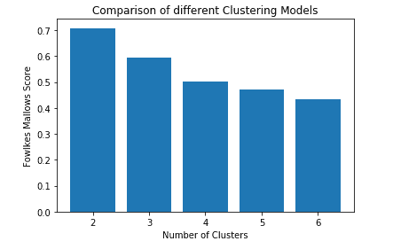

# ML |福尔克斯-锦葵评分

> 原文:[https://www.geeksforgeeks.org/ml-fowlkes-mallows-score/](https://www.geeksforgeeks.org/ml-fowlkes-mallows-score/)

**福尔克斯-马洛斯分数**是一种评估度量，用于评估在应用不同聚类算法后获得的聚类之间的相似性。虽然从技术上来说，它用于量化两个聚类之间的相似性，但它通常用于评估聚类算法的聚类性能，方法是假设第二个聚类是真实的，即观察到的数据，并假设它是完美的聚类。

假设数据中有 N 个数据点，聚类 A1 和 A2 中有 k 个数簇。然后矩阵 M 被构建成使得

![M = [m_{ij}]_{k\times k}](img/02a839b1394dda3c8996c447d250f39f.png "Rendered by QuickLaTeX.com")

其中确定聚类 A1 中第 ith 个聚类和聚类 A2 中第 jth 个聚类中的数据点数量。

参数 k 的福尔克斯-马洛司指数由下式给出


在哪里


以下术语在上述符号约定的上下文中定义

1.  **真正(TP):**A1 和 A2 中同一簇中的数据点对的数量。
2.  **假阳性(FP):** 在 A1 中同一簇中但不在 A2 中的数据点对的数量。
3.  **假阴性(FN):** 在 A1 中不在同一簇中但在 A2 中在同一簇中的数据点对的数量。
4.  **真负值(TN):** 既不在 A1 也不在 A2 的同一簇中的数据点对的数量。

明显地


因此福尔克斯-马洛克斯指数也可以表示为:-


重写上面的表达式


因此福尔克斯-马洛司指数是精确度和召回率的几何平均值。

**属性:**

*   **假设-Less:** 这个评估度量没有假设任何关于聚类结构的属性，因此证明比传统的评估方法有显著的优势。
*   **基本真实规则:**这种评估度量的一个缺点是，它需要基本真实规则(类标签)的知识来评估聚类算法。

以下步骤将演示如何使用 Sklearn 评估聚类算法的福尔克斯-马洛索引。以下步骤的数据集为**信用卡欺诈检测数据集**，可从[卡格尔](https://www.kaggle.com/mlg-ulb/creditcardfraud)下载。

**步骤 1:导入所需的库**

```py
import pandas as pd
import matplotlib.pyplot as plt
from sklearn.cluster import KMeans
from sklearn.metrics import fowlkes_mallows
```

**第二步:加载和清理数据**

```py
#Changing the working location to the location of the file
cd C:\Users\Dev\Desktop\Kaggle\Credit Card Fraud

#Loading the data
df = pd.read_csv('creditcard.csv')

#Separating the dependent and independent variables
y = df['Class']
X = df.drop('Class',axis=1)

X.head()
```


**第三步:建立不同的聚类，评估个人表现**

下面的代码步骤包括构建不同的 K-Means 聚类模型，每个模型都有不同的参数 n_clusters 值，然后使用 fowlks-mallos 评分来评估每个单独的性能。

```py
#List of Fowlkes-Mallows Scores for different models
fms_scores = []

#List of different number of clusters
N_Clusters = [2,3,4,5,6]
```

a) **n_clusters = 2**

```py
#Building the clustering model
kmeans2 = KMeans(n_clusters=2)

#Training the clustering model
kmeans2.fit(X)

#Storing the predicted Clustering labels
labels2 = kmeans2.predict(X)

#Evaluating the performance
fms_scores.append(fms(y,labels2))
```

b) **n_clusters = 3**

```py
#Building the clustering model
kmeans3 = KMeans(n_clusters=3)

#Training the clustering model
kmeans3.fit(X)

#Storing the predicted Clustering labels
labels3 = kmeans3.predict(X)

#Evaluating the performance
fms_scores.append(fms(y,labels3))
```

c) **n_clusters = 4**

```py
#Building the clustering model
kmeans4 = KMeans(n_clusters=4)

#Training the clustering model
kmeans4.fit(X)

#Storing the predicted Clustering labels
labels4 = kmeans4.predict(X)

#Evaluating the performance
fms_scores.append(fms(y,labels4))
```

d) **n_clusters = 5**

```py
#Building the clustering model
kmeans5 = KMeans(n_clusters=5)

#Training the clustering model
kmeans5.fit(X)

#Storing the predicted Clustering labels
labels5 = kmeans5.predict(X)

#Evaluating the performance
fms_scores.append(fms(y,labels5))
```

e) **n_clusters = 6**

```py
#Building the clustering model
kmeans6 = KMeans(n_clusters=6)

#Training the clustering model
kmeans6.fit(X)

#Storing the predicted Clustering labels
labels6 = kmeans6.predict(X)

#Evaluating the performance
fms_scores.append(fms(y,labels6))
```

```py
print(fms_scores)
```


**第四步:可视化和比较结果**

```py
#Plotting a Bar Graph to compare the models
plt.bar(N_Clusters,fms_scores)
plt.xlabel('Number of Clusters')
plt.ylabel('Fowlkes Mallows Score')
plt.title('Comparison of different Clustering Models')
plt.show()
```



因此，很明显，聚类数= 2 的聚类与观察到的数据最相似，因为数据只有两个类标签。