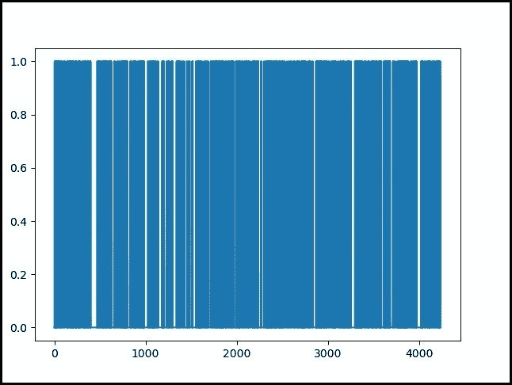
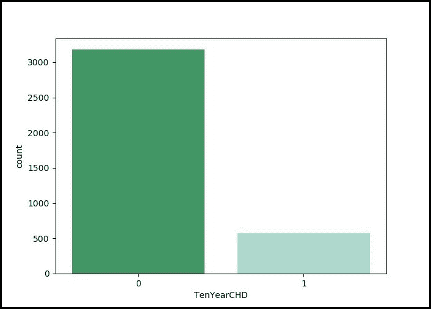
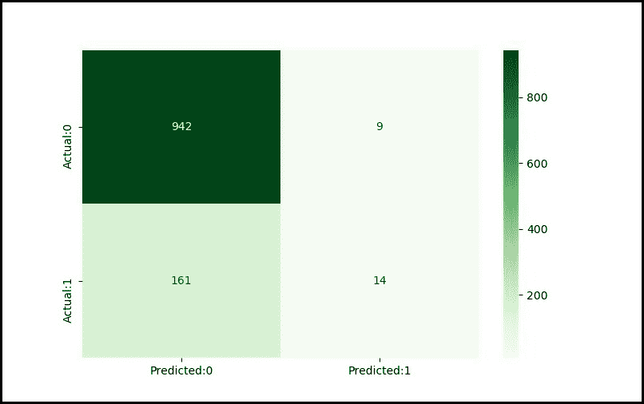

# ML |使用逻辑回归预测心脏病。

> 原文:[https://www . geesforgeks . org/ml-心脏病-预测-使用-逻辑回归/](https://www.geeksforgeeks.org/ml-heart-disease-prediction-using-logistic-regression/)

世界卫生组织估计，五分之四的心血管疾病死亡是由于心脏病发作。整个研究旨在精确指出很有可能受到心血管疾病影响的患者比例，并使用逻辑回归预测总体风险。

**什么是逻辑回归？**
逻辑回归是一种基于输入字段值对数据集记录进行分类的统计和机器学习技术。它基于一组或多组独立变量预测因变量，以预测结果。它既可用于二元分类，也可用于多类分类。要了解更多信息，请点击此处。

**代码:加载库。**

## 蟒蛇 3

```
import pandas as pd
import pylab as pl
import numpy as np
import scipy.optimize as opt
import statsmodels.api as sm
from sklearn import preprocessing
'exec(% matplotlib inline)'
import matplotlib.pyplot as plt
import matplotlib.mlab as mlab
import seaborn as sn
```

**数据准备:**
[数据集](https://www.kaggle.com/amanajmera1/framingham-heart-study-dataset)可在卡格尔网站上公开获得，它来自正在进行的对马萨诸塞州弗雷明汉镇居民的心血管研究。分类目标是预测患者是否有未来冠心病的 *10 年*风险。数据集提供了患者的信息。包括超过*4000 条*记录和 *15 个属性*。

**加载数据集。**

## 蟒蛇 3

```
# dataset
disease_df = pd.read_csv("../input / framingham.csv")
disease_df.drop(['education'], inplace = True, axis = 1)
disease_df.rename(columns ={'male':'Sex_male'}, inplace = True)

# removing NaN / NULL values
disease_df.dropna(axis = 0, inplace = True)
print(disease_df.head(), disease_df.shape)
print(disease_df.TenYearCHD.value_counts())
```

**输出:**

```
    Sex_male  age  currentSmoker  ...  heartRate  glucose  TenYearCHD
0         1   39              0  ...       80.0     77.0           0
1         0   46              0  ...       95.0     76.0           0
2         1   48              1  ...       75.0     70.0           0
3         0   61              1  ...       65.0    103.0           1
4         0   46              1  ...       85.0     85.0           0

[5 rows x 15 columns] (3751, 15)
0    3179
1     572
Name: TenYearCHD, dtype: int64
```

**代码:数据集中所有患者的十年冠心病记录:**

## 蟒蛇 3

```
# counting no. of patients affected with CHD
plt.figure(figsize = (7, 5))
sn.countplot(x ='TenYearCHD', data = disease_df,
             palette ="BuGn_r" )
plt.show()
```

**输出:图形显示:**



**代码:统计受冠心病影响的患者人数，其中(0=未受影响；1=受影响):**

## 蟒蛇 3

```
laste = disease_df['TenYearCHD'].plot()
plt.show(laste)
```

**输出:图形显示:**



**代码:训练和测试集:拆分数据|数据集归一化**

## 蟒蛇 3

```
X = np.asarray(disease_df[['age', 'Sex_male', 'cigsPerDay',
                           'totChol', 'sysBP', 'glucose']])
y = np.asarray(disease_df['TenYearCHD'])

# normalization of the dataset
X = preprocessing.StandardScaler().fit(X).transform(X)

# Train-and-Test -Split
from sklearn.model_selection import train_test_split
X_train, X_test, y_train, y_test = train_test_split(
        X, y, test_size = 0.3, random_state = 4)
print ('Train set:', X_train.shape,  y_train.shape)
print ('Test set:', X_test.shape,  y_test.shape)
```

**输出:**

```
Train Set :
(2625, 6) (2625, )

Test Set : 
(1126, 6) (1126, )
```

**代码:数据集建模|评估和准确性:**

## 蟒蛇 3

```
from sklearn.linear_model import LogisticRegression
logreg = LogisticRegression()
logreg.fit(X_train, y_train)
y_pred = logreg.predict(X_test)

# Evaluation and accuracy
from sklearn.metrics import jaccard_similarity_score
print('')
print('Accuracy of the model in jaccard similarity score is = ',
      jaccard_similarity_score(y_test, y_pred))
```

**输出:**

```
Accuracy of the model in jaccard similarity score is = 0.8490230905861457
```

**代码:用混淆矩阵求模型精度:**

## 蟒蛇 3

```
# Confusion matrix
from sklearn.metrics import confusion_matrix, classification_report

cm = confusion_matrix(y_test, y_pred)
conf_matrix = pd.DataFrame(data = cm,
                           columns = ['Predicted:0', 'Predicted:1'],
                           index =['Actual:0', 'Actual:1'])
plt.figure(figsize = (8, 5))
sn.heatmap(conf_matrix, annot = True, fmt = 'd', cmap = "Greens")
plt.show()

print('The details for confusion matrix is =')
print (classification_report(y_test, y_pred))

# This code is contributed by parna_28 .
```

**输出:**

```
The details for confusion matrix is =
              precision    recall  f1-score   support

           0       0.85      0.99      0.92       951
           1       0.61      0.08      0.14       175

    accuracy                           0.85      1126
   macro avg       0.73      0.54      0.53      1126
weighted avg       0.82      0.85      0.80      1126
```

**混乱矩阵:**

