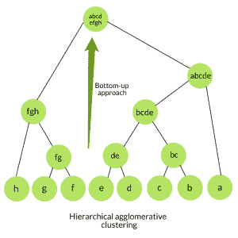
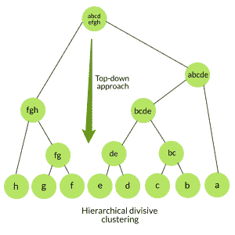

# ML |层次聚类(凝聚和分裂聚类)

> 原文:[https://www . geesforgeks . org/ml-层次-聚类-聚集-分裂-聚类/](https://www.geeksforgeeks.org/ml-hierarchical-clustering-agglomerative-and-divisive-clustering/)

在数据挖掘和统计中，层次聚类分析是一种聚类分析方法，旨在建立聚类的层次结构，即基于层次结构的树型结构。

**基本上有两种层次聚类分析策略–**

**1。聚集聚类:**也称为自下而上方法或层次聚集聚类(HAC)。一种比平面聚类返回的非结构化聚类集信息更丰富的结构。这种聚类算法不需要我们预先指定聚类的数量。自下而上的算法从一开始就将每个数据视为一个单独的集群，然后连续地聚集成对集群，直到所有集群都被合并成包含所有数据的单个集群。

**算法:**

```py
given a dataset (d1, d2, d3, ....dN) of size N
# compute the distance matrix
for i=1 to N:
   # as the distance matrix is symmetric about 
   # the primary diagonal so we compute only lower 
   # part of the primary diagonal 
   for j=1 to i:
      dis_mat[i][j] = distance[di, dj] 
each data point is a singleton cluster
repeat
   merge the two cluster having minimum distance
   update the distance matrix
until only a single cluster remains
```



使用 scikit-learn 库的上述算法的 Python 实现:

## 蟒蛇 3

```py
from sklearn.cluster import AgglomerativeClustering
import numpy as np

# randomly chosen dataset
X = np.array([[1, 2], [1, 4], [1, 0],
              [4, 2], [4, 4], [4, 0]])

# here we need to mention the number of clusters
# otherwise the result will be a single cluster
# containing all the data
clustering = AgglomerativeClustering(n_clusters = 2).fit(X)

# print the class labels
print(clustering.labels_)
```

**输出:**

```py
[1, 1, 1, 0, 0, 0]
```

**2。分裂聚类:**也称为自上而下的方法。该算法也不需要预先指定聚类的数量。自上而下的聚类需要一种方法来分割包含整个数据的聚类，并通过递归分割聚类来进行，直到单个数据被分割成单个聚类。

**算法:**

```py
given a dataset (d1, d2, d3, ....dN) of size N
at the top we have all data in one cluster
the cluster is split using a flat clustering method eg. K-Means etc
repeat
choose the best cluster among all the clusters to split
split that cluster by the flat clustering algorithm
until each data is in its own singleton cluster
```



**等级聚集** ***vs*** **分裂聚集–**

*   与聚集聚类相比，分裂聚类更复杂，因为在分裂聚类的情况下，我们需要一个平面聚类方法作为“子程序”来分割每个聚类，直到每个数据都有自己的单个聚类。
*   如果我们不生成一个完整的层次结构一直到单个数据叶，分裂聚类会更有效。初始聚集聚类的时间复杂度是 **O(n <sup>3</sup> )** ，因为我们在 N-1 次迭代中的每一次迭代中，都要详尽地扫描 N×N 矩阵 dist_mat 中的最低距离。使用优先级队列数据结构，我们可以将这种复杂性降低到**0(n<sup>2</sup>logn)**。通过使用更多的优化，它可以降低到**0(n<sup>2</sup>)**。而对于给定固定数量的顶层的分裂聚类，使用像 K-Means 这样的高效平面算法，分裂算法在模式和聚类的数量上是线性的。
*   除法算法也更精确。凝聚聚类通过考虑局部模式或邻近点来做出决策，而不首先考虑数据的全局分布。这些早期的决定无法撤销。而分裂聚类在做出顶层划分决策时会考虑数据的全局分布。