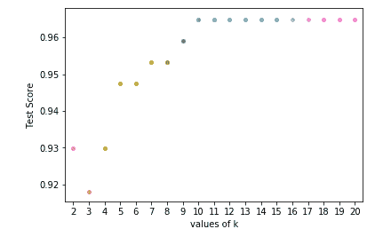

# ML |使用 Sklearn 实现 KNN 分类器

> 原文:[https://www . geeksforgeeks . org/ml-实现-KNN-分类器-使用-sklearn/](https://www.geeksforgeeks.org/ml-implementation-of-knn-classifier-using-sklearn/)

先决条件: [K 近邻算法](https://www.geeksforgeeks.org/k-nearest-neighbours/)

k 近邻算法是机器学习中最基本也是最基本的分类算法之一。它属于监督学习领域，在模式识别、数据挖掘和入侵检测中有着广泛的应用。由于它是非参数的，也就是说，它不会对数据的分布做出任何潜在的假设(与 GMM 等其他算法相反，后者假设给定数据为高斯分布)，因此在现实场景中可以广泛使用。

本文将演示如何使用 Python 的 [Sklearn 库](https://scikit-learn.org/stable/modules/generated/sklearn.neighbors.KNeighborsClassifier.html)实现 **K 近邻分类器算法**。

**步骤 1:导入所需的库**

```py
import numpy as np
import pandas as pd
from sklearn.model_selection import train_test_split
from sklearn.neighbors import KNeighborsClassifier
import matplotlib.pyplot as plt 
import seaborn as sns
```

**第二步:读取数据集**

```py
cd C:\Users\Dev\Desktop\Kaggle\Breast_Cancer
# Changing the read file location to the location of the file

df = pd.read_csv('data.csv')

y = df['diagnosis']
X = df.drop('diagnosis', axis = 1)
X = X.drop('Unnamed: 32', axis = 1)
X = X.drop('id', axis = 1)
# Separating the dependent and independent variable

X_train, X_test, y_train, y_test = train_test_split(
             X, y, test_size = 0.3, random_state = 0)
# Splitting the data into training and testing data
```

**第三步:训练模型**

```py
K = []
training = []
test = []
scores = {}

for k in range(2, 21):
    clf = KNeighborsClassifier(n_neighbors = k)
    clf.fit(X_train, y_train)

    training_score = clf.score(X_train, y_train)
    test_score = clf.score(X_test, y_test)
    K.append(k)

    training.append(training_score)
    test.append(test_score)
    scores[k] = [training_score, test_score]
```

**第四步:评估模型**

```py
for keys, values in scores.items():
    print(keys, ':', values)
```


我们现在试图找到‘k’的最佳值，即最近邻居的数量。

**第五步:绘制训练和考试成绩图**

```py
ax = sns.stripplot(K, training);
ax.set(xlabel ='values of k', ylabel ='Training Score')  

plt.show()
# function to show plot
```


```py
ax = sns.stripplot(K, test);
ax.set(xlabel ='values of k', ylabel ='Test Score')
plt.show()
```



```py
plt.scatter(K, training, color ='k')
plt.scatter(K, test, color ='g')
plt.show()
# For overlapping scatter plots
```


从上面的散点图中，我们可以得出 k 的最佳值将在 5 左右的结论。