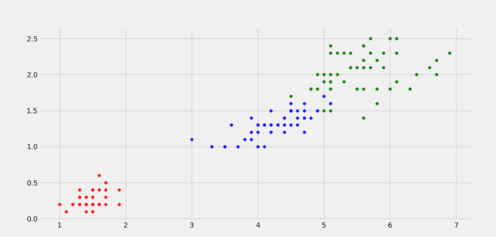
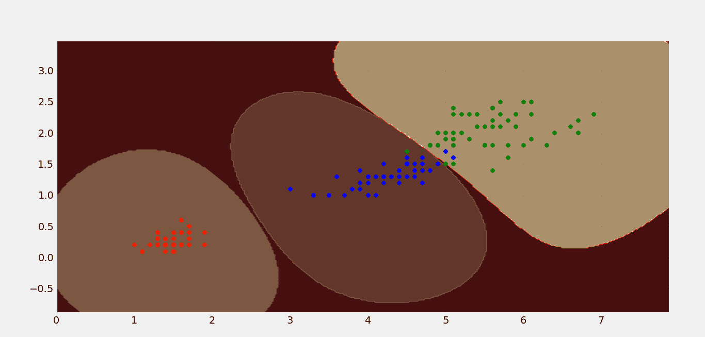

# ML |非线性 SVM

> 原文:[https://www.geeksforgeeks.org/ml-non-linear-svm/](https://www.geeksforgeeks.org/ml-non-linear-svm/)

**先决条件:** [使用 SVM](https://www.geeksforgeeks.org/classifying-data-using-support-vector-machinessvms-in-python/) 对数据进行分类

在[线性 SVM](https://www.geeksforgeeks.org/creating-linear-kernel-svm-in-python/) 中，两个类是线性可分的，即一条直线能够对两个类进行分类。但是想象一下，如果你有三个类，显然它们不会线性分离。因此，在处理类不可线性分离的这类数据时，非线性 SVM 就派上了用场。

我们将讨论一个非线性核，径向基函数核。所以，这个内核基本上做的是，它试图把给定的数据转换成几乎线性可分的数据。

让我们考虑虹膜数据集的例子，它只绘制了 4 个特征中的 2 个(花瓣长度和花瓣宽度)。

以下是相同的散点图:


很明显，这些类不是线性可分的。下面是非线性 SVM 的等高线图，它使用径向基函数核成功地对虹膜数据集进行了分类。

上图展示了 IRIS 数据集三类的分类。

> 1.  From sklearn, we imported SVM library.
> 2.  We created three nonlinear SVM (based on radial basis kernel).
> 3.  Only one SVM feed remained positive, and the other two were negative. For example, SVM1 only has labels corresponding to category 1, otherwise all labels are 0\. SVM2 and SVM3 are the same respectively.
> 4.  Draw contour map of each SVM.
> 5.  Draw data points.

下面是相同的 Python 实现。

```py
import numpy as np 
import pandas as pd 
import matplotlib.pyplot as plt 
from matplotlib import style
from sklearn.svm import SVC 

style.use('fivethirtyeight')

# create mesh grids
def make_meshgrid(x, y, h =.02):
    x_min, x_max = x.min() - 1, x.max() + 1
    y_min, y_max = y.min() - 1, y.max() + 1
    xx, yy = np.meshgrid(np.arange(x_min, x_max, h), np.arange(y_min, y_max, h))
    return xx, yy

# plot the contours
def plot_contours(ax, clf, xx, yy, **params):
    Z = clf.predict(np.c_[xx.ravel(), yy.ravel()])
    Z = Z.reshape(xx.shape)
    out = ax.contourf(xx, yy, Z, **params)
    return out

color = ['r', 'b', 'g', 'k']

iris = pd.read_csv("iris-data.txt").values

features = iris[0:150, 2:4]
level1 = np.zeros(150)
level2 = np.zeros(150)
level3 = np.zeros(150)

# level1 contains 1 for class1 and 0 for all others.
# level2 contains 1 for class2 and 0 for all others.
# level3 contains 1 for class3 and 0 for all others.
for i in range(150):
    if i>= 0 and i<50:
        level1[i] = 1
    elif i>= 50 and i<100:
        level2[i] = 1
    elif i>= 100 and i<150:
        level3[i]= 1

# create 3 svm with rbf kernels
svm1 = SVC(kernel ='rbf')
svm2 = SVC(kernel ='rbf')
svm3 = SVC(kernel ='rbf')

# fit each svm's
svm1.fit(features, level1)
svm2.fit(features, level2)
svm3.fit(features, level3)

fig, ax = plt.subplots()
X0, X1 = iris[:, 2], iris[:, 3]
xx, yy = make_meshgrid(X0, X1)

# plot the contours
plot_contours(ax, svm1, xx, yy, cmap = plt.get_cmap('hot'), alpha = 0.8)
plot_contours(ax, svm2, xx, yy, cmap = plt.get_cmap('hot'), alpha = 0.3)
plot_contours(ax, svm3, xx, yy, cmap = plt.get_cmap('hot'), alpha = 0.5)

color = ['r', 'b', 'g', 'k']

for i in range(len(iris)):
    plt.scatter(iris[i][2], iris[i][3], s = 30, c = color[int(iris[i][4])])
plt.show()
```