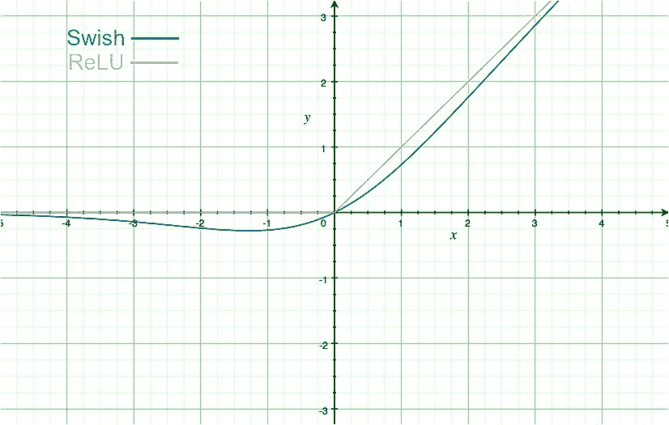

# ML–谷歌在 Keras 的 Swish 功能

> 原文:[https://www . geesforgeks . org/ml-swish-function-by-Google-in-keras/](https://www.geeksforgeeks.org/ml-swish-function-by-google-in-keras/)

ReLU 一直是深度学习社区中最好的激活功能，但谷歌大脑团队在 2017 年宣布 Swish 作为 ReLU 的替代品。论文作者的研究表明，简单地用 Swish 单位替换 ReLU 单位可以将 ImageNet 上的分类精度提高 0.6%，从而在许多深度神经网络中优于 ReLU。

**嗖嗖激活功能:**

*   数学公式: **Y = X * sigmoid(X)**
*   下方有界上方无界: *Y* 在 *X* 趋近于常数值，但 *Y* 趋近于无穷大，如同 *X* 趋近于无穷大。
*   Swish 的导数，**Y’= Y+sigmoid(X)*(1-Y)**
*   软曲线和非单调函数。



Swish 诉 ReLU 案

**优于 RelU 激活功能:**

对于激活函数来说，没有边界是可取的，因为它避免了梯度几乎为零时的问题。ReLU 函数在上面是有界的，但是当我们考虑下面的区域时，那么在下面是有界的可能会在一定程度上正则化模型，并且在负无穷大的极限内接近零的函数在正则化方面也很棒，因为大的负输入被丢弃了。swish 函数提供了非单调功能，增强了输入数据的表达和要学习的权重。
下面是 Swish 函数对许多社区主导激活函数(如 ReLU、卢瑟、Leaky ReLU 等)的性能度量。


**在 keras 中实现 Swish 激活功能:**
Swish 在 Keras 中实现为自定义功能，定义后必须在激活类中用密钥注册。

**代码:**

```
# Code from between to demonstrate the implementation of Swish

# Our aim is to use "swish" in place of "relu" and make compiler understand it
model.add(Dense(64, activation = "relu"))
model.add(Dense(16, activation = "relu"))
```

现在我们将创建一个名为 Swish 的自定义函数，它可以根据 Swish 激活函数的数学公式给出如下输出:

```
# Importing the sigmoid function from
# Keras backend and using it
from keras.backend import sigmoid

def swish(x, beta = 1):
    return (x * sigmoid(beta * x))
```

现在我们有了定制设计的函数，可以将输入处理为 Swish 激活，我们需要向 Keras 注册这个定制对象。为此，我们在字典中传递一个我们想要调用它的键和它的激活函数。激活类将实际构建函数。

**代码:**

```
# Getting the Custom object and updating them
from keras.utils.generic_utils import get_custom_objects
from keras.layers import Activation

# Below in place of swish you can take any custom key for the name 
get_custom_objects().update({'swish': Activation(swish)})
```

**代码:实现自定义设计的激活功能**

```
model.add(Dense(64, activation = "swish"))
model.add(Dense(16, activation = "swish"))
```