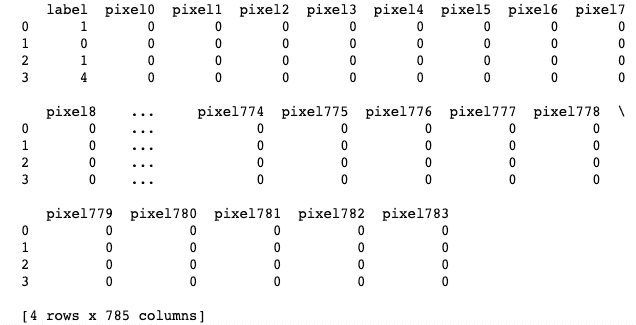
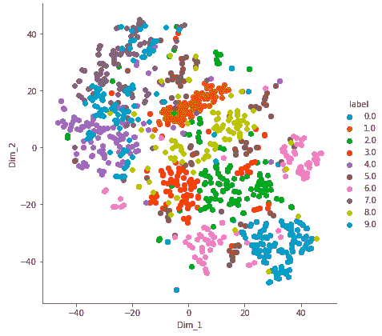

# ML | T 分布随机邻域嵌入(t-SNE)算法

> 原文:[https://www . geesforgeks . org/ml-t-分布式-随机-邻居-嵌入-t-SNE-算法/](https://www.geeksforgeeks.org/ml-t-distributed-stochastic-neighbor-embedding-t-sne-algorithm/)

**T-分布式随机邻居嵌入(t-SNE)** 是一种非线性降维技术，非常适合在二维或三维的低维空间中嵌入用于可视化的高维数据。

**什么是降维？**
降维是以 2 维或 3 维表示 n 维数据(具有许多特征的多维数据)的技术。
降维的一个例子可以作为一个分类问题来讨论，也就是说，依赖于温度和湿度的学生是否会踢足球可以折叠成一个基本特征，因为这两个特征在很大程度上是相关的。因此，我们可以减少此类问题中的特征数量。三维分类问题可能很难可视化，而二维分类问题可以映射到简单的二维空间，一维分类问题可以映射到简单的直线。

**t-SNE 是如何工作的？**
t-SNE 一种非线性降维算法，基于数据点与特征的相似性来发现数据中的模式，点的相似性被计算为点 A 选择点 B 作为其邻居的条件概率。
然后，它试图最小化高维和低维空间中这些条件概率(或相似性)之间的差异，以便在低维空间中完美地表示数据点。

**空间和时间复杂度:**
该算法计算成对的条件概率，并试图最小化较高维度和较低维度的概率差之和。这需要大量的计算。因此，该算法需要大量的时间和空间来计算。t-SNE 在数据点的数量上具有二次时间和空间复杂度。

**代码:在 MNIST 数据集上实现 T-SNE 的 Python 代码**

## 蟒蛇 3

```
# Importing Necessary Modules.
import numpy as np
import pandas as pd
import matplotlib.pyplot as plt
from sklearn.manifold import TSNE
from sklearn.preprocessing import StandardScaler
```

**代码#1:读取数据**

## 蟒蛇 3

```
# Reading the data using pandas 
df = pd.read_csv('mnist_train.csv')

# print first five rows of df
print(df.head(4))

# save the labels into a variable l.
l = df['label']

# Drop the label feature and store the pixel data in d.
d = df.drop("label", axis = 1)
```

**输出:**



**代码#2:** 数据预处理

## 蟒蛇 3

```
# Data-preprocessing: Standardizing the data
from sklearn.preprocessing import StandardScaler

standardized_data = StandardScaler().fit_transform(data)
print(standardized_data.shape)
```

**输出:**

```
(15000, 784)
```

**代码#3:**

## 蟒蛇 3

```
# TSNE
# Picking the top 1000 points as TSNE
# takes a lot of time for 15K points
data_1000 = standardized_data[0:1000, :]
labels_1000 = labels[0:1000]

model = TSNE(n_components = 2, random_state = 0)
# configuring the parameters
# the number of components = 2
# default perplexity = 30
# default learning rate = 200
# default Maximum number of iterations
# for the optimization = 1000

tsne_data = model.fit_transform(data_1000)

# creating a new data frame which
# help us in ploting the result data
tsne_data = np.vstack((tsne_data.T, labels_1000)).T
tsne_df = pd.DataFrame(data = tsne_data,
     columns =("Dim_1", "Dim_2", "label"))

# Ploting the result of tsne
sn.FacetGrid(tsne_df, hue ="label", size = 6).map(
       plt.scatter, 'Dim_1', 'Dim_2').add_legend()

plt.show()
```

**输出:**

