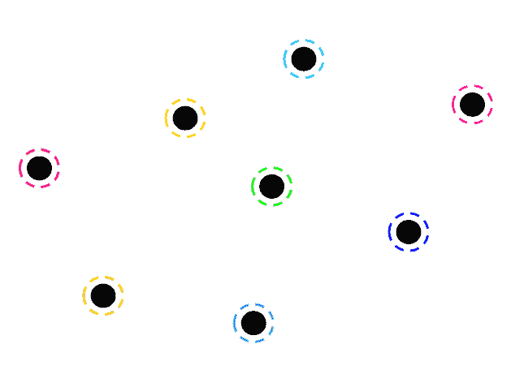
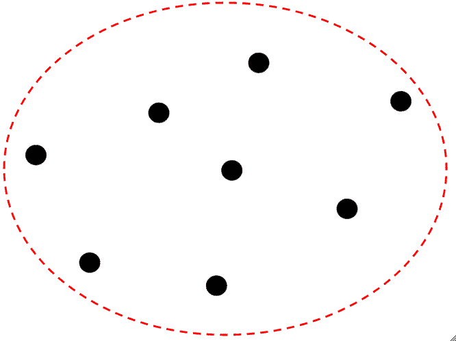
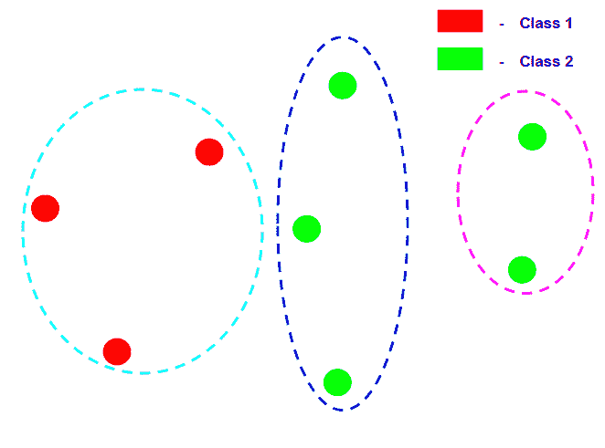
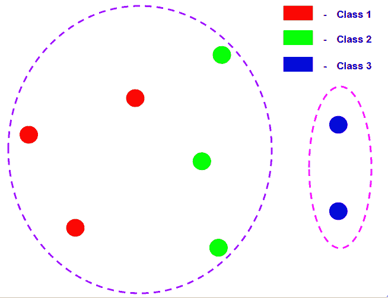

# ML | V-评价聚类性能的测度

> 原文:[https://www . geesforgeks . org/ml-v-measure-for-evaluation-clustering-performance/](https://www.geeksforgeeks.org/ml-v-measure-for-evaluating-clustering-performance/)

任何聚类技术的主要缺点之一是难以评估其性能。为了解决这个问题，开发了 **V-Measure** 的度量。

V-测度的计算首先需要计算两个项:-

1.  **同质性:**完全同质聚类是指每个聚类都有属于同一类别标签的数据点。同质性描述了聚类算法的接近程度。
2.  **完备性:**完全完备聚类是指属于同一类的所有数据点都被聚类到同一个聚类中。完备性描述了聚类算法接近这种完美的程度。

**平凡同质性:**是指聚类数等于数据点数，每个点恰好在一个聚类中的情况。当同质性最高而完备性最低时，就是极端情况。



**平凡完备性:**是指所有数据点都聚集成一个簇的情况。当同质性最小，完备性最大时，就是极端情况。



假设上述图表中的每个数据点都有不同的“平凡同质性”和“平凡完备性”的类标签。

**注意:**同质化这个术语不同于完备性，因为在谈论同质化的时候，基本概念是各个聚类的概念，我们检查每个聚类中的每个数据点是否属于相同的类标签。谈到完整性，基本概念是各自的类标签，我们检查每个类标签的数据点是否在同一个簇中。



在上图中，聚类是完全同质的，因为在每个聚类中，的数据点具有相同的类标签，但它并不完整，因为不是同一类标签的所有数据点都属于同一类标签。



在上图中，聚类是完全完整的，因为同一个类标签的所有数据点都属于同一个聚类，但是它不是同质的，因为第一个聚类包含许多类标签的数据点。

假设有 N 个数据样本，C 个不同的类别标签，K 个聚类和属于类别 C 和聚类 K 的数据点数量，那么同质性 h 由下式给出:-


在哪里


和


完整性 c 由以下各项给出


在哪里


和


因此，加权垂直测量由下式给出:-


因子可以被调整以有利于聚类算法的同质性或完整性。

这种评估指标的主要优点是，它独立于类标签的数量、聚类的数量、数据的大小和使用的聚类算法，是一种非常可靠的指标。

下面的代码将演示如何计算聚类算法的 V-Measure。所用数据为信用卡诈骗**检测**，可从[卡格尔](https://www.kaggle.com/mlg-ulb/creditcardfraud)下载。使用的聚类算法是高斯混合模型的**变分贝叶斯推理**。

**步骤 1:导入所需的库**

```
import pandas as pd
import matplotlib.pyplot as plt
from sklearn.cluster import KMeans
from sklearn.metrics import v_measure_score
```

**第二步:加载和清理数据**

```
# Changing the working location to the location of the file
cd C:\Users\Dev\Desktop\Kaggle\Credit Card Fraud

# Loading the data
df = pd.read_csv('creditcard.csv')

# Separating the dependent and independent variables
y = df['Class']
X = df.drop('Class', axis = 1)

X.head()
```


**第三步:建立不同的聚类模型并比较它们的 V-Measure 分数**

在这一步中，将建立 5 个不同的 K-Means 聚类模型，每个模型将数据聚类成不同数量的聚类。

```
# List of V-Measure Scores for different models
v_scores = []

# List of different types of covariance parameters
N_Clusters = [2, 3, 4, 5, 6]
```

a) **n_clusters = 2**

```
# Building the clustering model
kmeans2 = KMeans(n_clusters = 2)

# Training the clustering model
kmeans2.fit(X)

# Storing the predicted Clustering labels
labels2 = kmeans2.predict(X)

# Evaluating the performance
v_scores.append(v_measure_score(y, labels2))
```

b) **n_clusters = 3**

```
# Building the clustering model
kmeans3 = KMeans(n_clusters = 3)

# Training the clustering model
kmeans3.fit(X)

# Storing the predicted Clustering labels
labels3 = kmeans3.predict(X)

# Evaluating the performance
v_scores.append(v_measure_score(y, labels3))
```

c) **n_clusters = 4**

```
# Building the clustering model
kmeans4 = KMeans(n_clusters = 4)

# Training the clustering model
kmeans4.fit(X)

# Storing the predicted Clustering labels
labels4 = kmeans4.predict(X)

# Evaluating the performance
v_scores.append(v_measure_score(y, labels4))
```

d) **n_clusters = 5**

```
# Building the clustering model
kmeans5 = KMeans(n_clusters = 5)

# Training the clustering model
kmeans5.fit(X)

# Storing the predicted Clustering labels
labels5 = kmeans5.predict(X)

# Evaluating the performance
v_scores.append(v_measure_score(y, labels5))
```

e) **n_clusters = 6**

```
# Building the clustering model
kmeans6 = KMeans(n_clusters = 6)

# Training the clustering model
kmeans6.fit(X)

# Storing the predicted Clustering labels
labels6 = kmeans6.predict(X)

# Evaluating the performance
v_scores.append(v_measure_score(y, labels6))
```

**第四步:可视化结果并比较性能**

```
# Plotting a Bar Graph to compare the models
plt.bar(N_Clusters, v_scores)
plt.xlabel('Number of Clusters')
plt.ylabel('V-Measure Score')
plt.title('Comparison of different Clustering Models')
plt.show()
```

