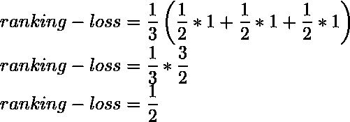

# 多标签排名指标–排名损失| ML

> 原文:[https://www . geesforgeks . org/multi label-ranking-metrics-ranking-loss-ml/](https://www.geeksforgeeks.org/multilabel-ranking-metrics-ranking-loss-ml/)

排名损失定义为相对于正确排序标签的数量，错误排序标签的数量。排名损失的最佳值可以为零

给定一个基本事实标签的二进制指示矩阵

<center></center>

The score associated with each label is denoted by  where,

<center>

</center>

Ranking Loss can be calculated as :

<center>
</center>

其中表示集合中非零元素的个数，表示向量中元素的个数(集合的基数)。最小排名损失可以是 0。这是当所有标签在预测标签中正确排序的时候。

**代码:使用 scikit-learn 库实现 Ranking Loss 的 Python 代码。**

```py
# import sklearn and numpy libraries
import numpy as np
from sklearn.metrics import label_ranking_loss

# take sample dataset
y_true = np.array([[1, 0, 0], [0, 1, 0], [0, 0, 1]])
y_pred_score = np.array([[0.75, 0.5, 1], [1, 0.2, 0.1], [0.1, 1, 0.9]])

# calculate and print label ranking loss
print(label_ranking_loss(y_true, y_pred_score ))

# this will give minimum ranking loss
y_pred_score = np.array([[0.75, 0.5, 0.1], [0.1, 0.6, 0.1], [0.3, 0.3, 0.4]])
print(label_ranking_loss(y_true, y_pred_score ))
```

**输出:**

```py
0.5
0
```

在第一个预测的第一个样本中，唯一的非零标签排在前 2 位。类似地，对于第二和第三样本。所有的在地面真相标签中只有一个非标签。

<center>

</center>

By putting these values in the formula we get,

<center>

</center>

In the second print statement, All the ground truth label corresponds to the highest value in the predicted label. Hence, the ranking loss is 0\. We can also got the same answer when we put those values in the formula because the rightmost term for each sample is *0*.
**References:**

*   左马卡斯，g .，Katakis，I .，& Vlahavas，I. (2010 年)。挖掘多标签数据。数据挖掘和知识发现手册(第 667-685 页)。斯普林格美国公司。