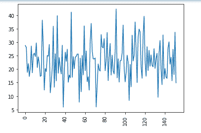

# sklearn . cross _ declaration。Python 中的 PLSRegression()函数

> 原文:[https://www . geesforgeks . org/sklearn-cross _ declaration-pls gression-function-in-python/](https://www.geeksforgeeks.org/sklearn-cross_decomposition-plsregression-function-in-python/)

偏最小二乘回归是一种考虑两个数据集中潜在结构的回归方法。由于单标签和多标签学习的原因，偏最小二乘回归在基于磁共振成像的评估中表现良好。PLS 回归通过模式=“A”和通缩模式=“回归”从 PLS 获取。此外，已知的 PLS2 或 PLS 在一维响应的情况下。

> **语法:**class sklearn . cross _ declaration。pls 回归(n_components=2，*比例=真，max_iter=500，tol=1e-06，copy =真)
> 
> **参数:**
> 
> 该函数接受上面提到的和下面定义的五个参数:
> 
> *   **n _ components:**<*int*>**:其默认值为 2，接受需要保留的组件数量。**
> *   **缩放:**<*bool*>**:**其默认值为 True，接受是否缩放数据。
> *   **max _ iteran:**<*int*>**:其默认值为 500，接受 NIPALS 内循环的最大迭代次数。**
> *   **tol:** < *非负实* > **:** 其默认值为 1e-06，接受迭代算法中使用的公差。
> *   **副本:**<*bool*>**:**其默认值为 True，表示应该在副本上进行偏转。当默认值设置为真时，不要在意副作用。
> 
> **返回值:**pls reduce 是一种预测响应的方法。

下面的例子说明了 PLSRegression()模型的使用。

**示例:**

## 蟒蛇 3

```py
import numpy as np
import pandas as pd
from sklearn import datasets
import matplotlib.pyplot as plt
from sklearn.cross_decomposition import PLSRegression
from sklearn.model_selection import train_test_split

# load boston data using sklearn datasets
boston = datasets.load_boston()

# separate data and target values
x = boston.data
y = boston.target

# tabular data structure with labeled axes
# (rows and columns) using DataFrame
df_x = pd.DataFrame(x, columns=boston.feature_names)
df_y = pd.DataFrame(y)

# create PLSRegression model
pls2 = PLSRegression(n_components=2)

# split data
x_train, x_test, y_train, y_test = train_test_split(
    df_x, df_y, test_size=0.30, random_state=1)

# fit the model
pls2.fit(x_train, y_train)

# predict the values
Y_pred = pls2.predict(x_test)

# plot the predicted Values
plt.plot(Y_pred)
plt.xticks(rotation=90)
plt.show()

# print the predicted value
print(Y_pred)
```

**输出:**

使用 pls 回归绘制预测值



使用训练好的模型打印预测值

