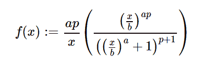

# python 中的 sympy.stats.Dagum()

> 原文:[https://www.geeksforgeeks.org/sympy-stats-dagum-in-python/](https://www.geeksforgeeks.org/sympy-stats-dagum-in-python/)

借助`**sympy.stats.Dagum()**`方法，我们可以得到代表达古姆分布的连续随机变量。



> **语法:** `sympy.stats.Dagum(name, p, a, b)`
> 其中，p、a、b 为大于 0 的实数。
> **返回:**返回连续随机变量。

**例#1 :**
在这个例子中我们可以看到，通过使用`sympy.stats.Dagum()`方法，我们能够通过使用这个方法得到代表达古姆分布的连续随机变量。

```py
# Import sympy and Dagum
from sympy.stats import Dagum, density
from sympy import Symbol

p = Symbol("p", integer = True, positive = True)
a = Symbol("a", integer = True, positive = True)
b = Symbol("b", integer = True, positive = True)
z = Symbol("z")

# Using sympy.stats.Dagum() method
X = Dagum("x", p, a, b)
gfg = density(X)(z)

pprint(gfg)
```

**输出:**

> -p–1
> a * p/a \
> /z \ |/z \ |
> a * p * |-| * |-|+1 |
> \ b/\ \ b//
> —————
> z

**例 2 :**

```py
# Import sympy and Dagum
from sympy.stats import Dagum, density
from sympy import Symbol

p = 3
a = 2
b = 5
z = 0.4

# Using sympy.stats.Dagum() method
X = Dagum("x", p, a, b)
gfg = density(X)(z)

pprint(gfg)
```

**输出:**

> 3.8308692944853 e-6