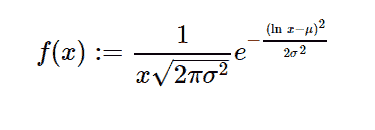

# python 中的 sympy.stats.LogNormal()

> 原文:[https://www . geesforgeks . org/sympy-stats-lognormal-in-python/](https://www.geeksforgeeks.org/sympy-stats-lognormal-in-python/)

借助`**sympy.stats.LogNormal()**`方法，我们可以得到代表对数正态分布的连续随机变量。



> **句法:** `sympy.stats.LogNormal(name, mean, std)`
> 其中，均值和标准差为实数。
> **返回:**返回连续随机变量。

**示例#1 :**
在这个示例中我们可以看到，通过使用`sympy.stats.LogNormal()`方法，我们能够使用该方法获得表示 Log-Normal 分布的连续随机变量。

```py
# Import sympy and LogNormal
from sympy.stats import LogNormal, density
from sympy import Symbol, pprint

z = Symbol("z")
mean = Symbol("mean", positive = True)
std = Symbol("std", positive = True)

# Using sympy.stats.LogNormal() method
X = LogNormal("x", mean, std)
gfg = density(X)(z)

pprint(gfg)
```

**输出:**

> 2
> -(-均值+对数(z))
> ———
> 2
> _ _ _ 2 * STD
> \/2 * e
> ——————
> _ _ _ _
> 2 * \/pi * STD * z

**例 2 :**

```py
# Import sympy and LogNormal
from sympy.stats import LogNormal, density
from sympy import Symbol, pprint

z = 2.1
mean = 7.6
std = 4

# Using sympy.stats.LogNormal() method
X = LogNormal("x", mean, std)
gfg = density(X)(z)

pprint(gfg)
```

**输出:**

> 0.0136890249307238 * \/2
> —————
> _ _ _ _
> \/pi