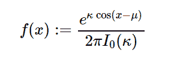

# 不错的统计数字。狄米斯()在 Python 中

> 哎哎哎:# t0]https://www . geeksforgeeks . org/symy-stats-ms ises-in-python/

借助`**sympy.stats.VonMises()**`方法，我们可以得到代表冯米塞斯分布的连续随机变量。



> **语法:** `sympy.stats.VonMises(name, mu, k)`
> 其中，mu 和 k 为实数。
> **返回:**返回连续随机变量。

**示例#1 :**
在这个示例中我们可以看到，通过使用`sympy.stats.VonMises()`方法，我们能够使用该方法获得表示冯米塞斯分布的连续随机变量。

```py
# Import sympy and VonMises
from sympy.stats import VonMises, density
from sympy import Symbol, pprint

z = Symbol("z")
mu = Symbol("mu", positive = True)
k = Symbol("k", positive = True)

# Using sympy.stats.VonMises() method
X = VonMises("x", mu, k)
gfg = density(X)(z)

pprint(gfg)
```

**输出:**

> k * cos(μ–z)
> e
> ———
> 2 * pi * besseli(0，k)

**例 2 :**

```py
# Import sympy and VonMises
from sympy.stats import VonMises, density
from sympy import Symbol, pprint

z = 0.78
mu = 1.23
k = 4

# Using sympy.stats.VonMises() method
X = VonMises("x", mu, k)
gfg = density(X)(z)

pprint(gfg)
```

**输出:**

> 18.33187167628
> —————
> pi *贝塞利(0，4)