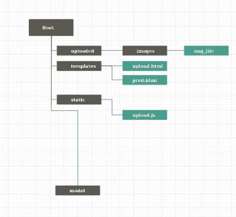
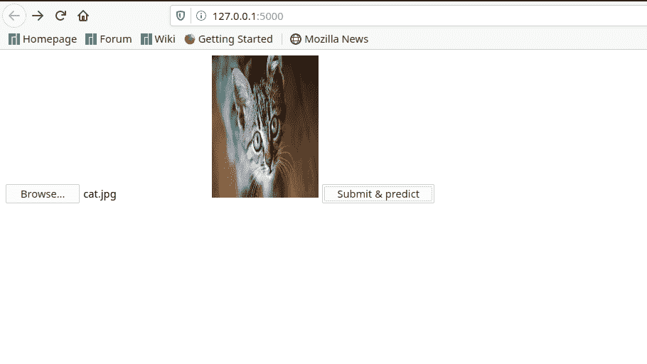
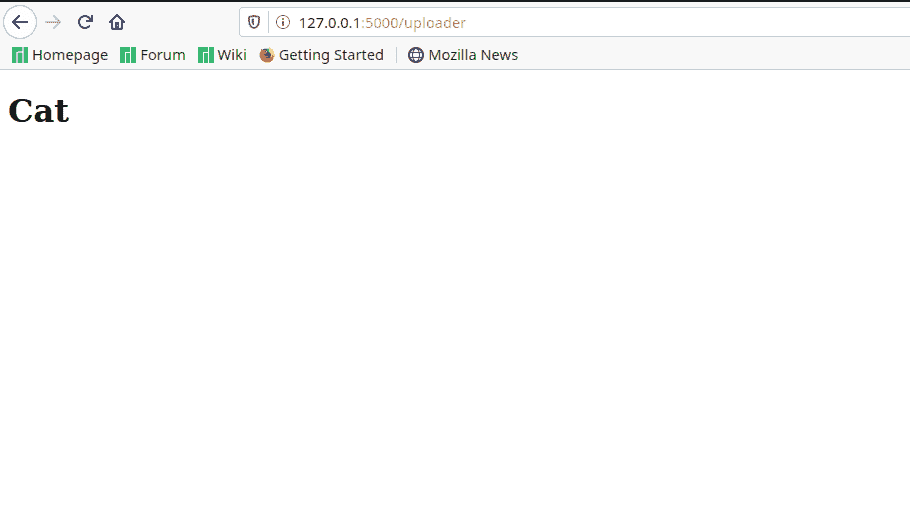
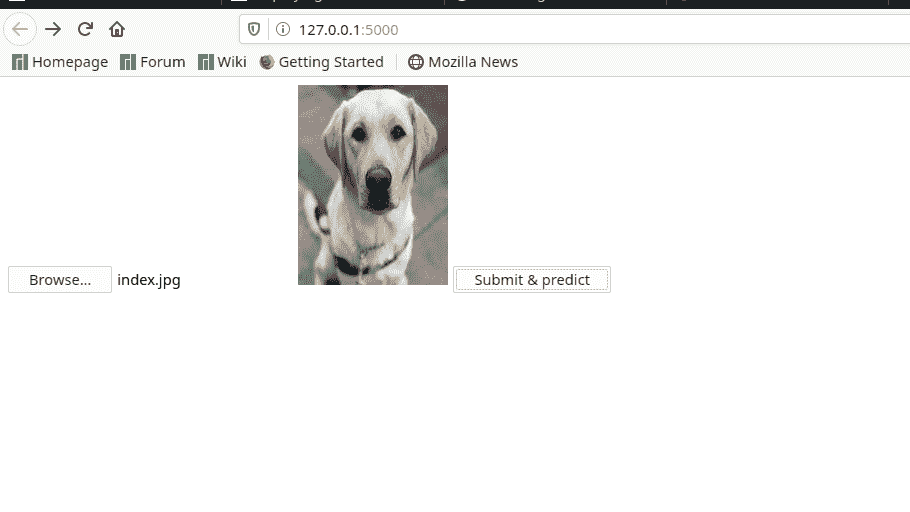
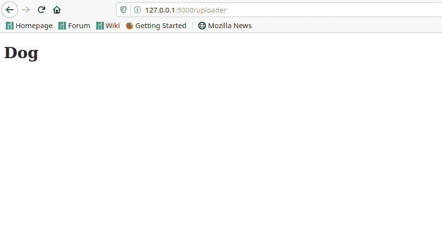

# 使用 Flask

在网络上部署 TensorFlow 2.1 CNN 模型

> 原文:[https://www . geeksforgeeks . org/deployment-a-tensorflow-2-1-CNN-model-on-web-on-with-flask/](https://www.geeksforgeeks.org/deploying-a-tensorflow-2-1-cnn-model-on-the-web-with-flask/)

当开始学习机器学习时，人们面临的最大问题之一是将他们制作的任何东西部署到网络上，以便于演示/使用。本文将帮助那些初学者弥合创建 TensorFlow 模型和使用 Flask 在网络上部署模型之间的差距，并希望对 TensorFlow 和 Flask 存在的问题有所了解。

**创建模型**
首先，我们将不得不使用 TensorFlow 和 Keras 的 ImageDataGenerator 来训练我们的模型。为此，我们分别下载了 12500 张猫的图片和 12500 张狗的图片。要使用 ImageDataGenerator 训练模型，首先安装`keras`和`tensorflow`，

```
pip install keras
```

```
pip install tensorflow
```

我们使用`InceptionV3`模型的迁移学习训练了一个模型。有关迁移学习的教程，请访问[此链接。](https://machinelearningmastery.com/how-to-use-transfer-learning-when-developing-convolutional-neural-network-models/)模型训练完成后，我们需要执行以下命令，为训练好的模型创建一个模型文件夹。(在 TensorFlow 2.0 之前，创建的是模型文件，而不是模型文件夹)。

```
model.save('Name_of_model')
```

**创建烧瓶应用程序**
然后，我们将不得不安装烧瓶。Flask 是 Python 中的一个微框架，广泛用于在网络上部署 ML 模型，我们将不得不使用以下命令安装 flask。

```
pip install flask
```

来到我们想要建立的网页。创建一个 HTML 页面根据您的喜好，我们已经创建了一个基本的网页，带有一个上传图像的按钮和一个预测图像是什么的按钮。这段代码将图像作为发布请求发送，并将其存储在“上传/图像/”文件夹中，在此进行预测。来自堆栈溢出的[舒巴姆·纳伊克](https://stackoverflow.com/questions/42825157/upload-an-image-and-display-it-back-as-a-response-using-flask)的礼遇。代码分为两个文件，即. js 文件和. html 文件。将下面的代码复制到名为`upload.html`的文件中，并保存在名为 templates 的文件夹中。

```
<!DOCTYPE html>

<html>

<head>
    <link class="jsbin" href="http://ajax.googleapis.com/ajax/libs/jqueryui/1/themes/base/jquery-ui.css"
        rel="stylesheet" type="text/css" />
    <script class="jsbin" src="http://ajax.googleapis.com/ajax/libs/jquery/1/jquery.min.js"></script>
    <script class="jsbin" src="http://ajax.googleapis.com/ajax/libs/jqueryui/1.8.0/jquery-ui.min.js"></script>
    <meta charset=utf-8 />

    <script src="{{ url_for('static', filename='upload.js') }}"></script>

    <style>
        article,
        aside,
        figure,
        footer,
        header,
        hgroup,
        menu,
        nav,
        section {
            display: block;
        }
    </style>
</head>

<body>
    <form action="http://127.0.0.1:5000/uploader" method="POST" enctype="multipart/form-data">
        <input type='file' name='file' onchange="readURL(this);" />
        
        <button type="submit">Submit & predict</button>

    </form>
</body>

</html>
```

将下面的代码复制到一个名为`upload.js`的文件中，并保存在一个名为 static 的文件夹中。

```
function readURL(input) {
if (input.files && input.files[0]) {
    var reader = new FileReader();

    reader.onload = function (e) {
        $('#blah')
            .attr('src', e.target.result)
            .width(150)
            .height(200);
    };

    reader.readAsDataURL(input.files[0]);
}
}
```

完成此操作后，我们将需要`ImageDataGenerator`对训练后的图像进行预测。首先，我们将使用加载模型

```
model = tf.keras.models.load_model('Name_of_model')
```

然后，我们需要导入 ImageDataGenerator。现在，来看看烧瓶的代码。将下面的代码复制到一个`Code.py`文件中，放在根目录下。完整的 Python 代码如下:-

```
from flask import Flask, render_template, request
from werkzeug import secure_filename
from keras.preprocessing.image import ImageDataGenerator
import tensorflow as tf
import numpy as np
import os 

try:
    import shutil
    shutil.rmtree('uploaded / image')
    % cd uploaded % mkdir image % cd ..
    print()
except:
    pass

model = tf.keras.models.load_model('model')
app = Flask(__name__)

app.config['UPLOAD_FOLDER'] = 'uploaded / image'

@app.route('/')
def upload_f():
    return render_template('upload.html')

def finds():
    test_datagen = ImageDataGenerator(rescale = 1./255)
    vals = ['Cat', 'Dog'] # change this according to what you've trained your model to do
    test_dir = 'uploaded'
    test_generator = test_datagen.flow_from_directory(
            test_dir,
            target_size =(224, 224),
            color_mode ="rgb",
            shuffle = False,
            class_mode ='categorical',
            batch_size = 1)

    pred = model.predict_generator(test_generator)
    print(pred)
    return str(vals[np.argmax(pred)])

@app.route('/uploader', methods = ['GET', 'POST'])
def upload_file():
    if request.method == 'POST':
        f = request.files['file']
        f.save(os.path.join(app.config['UPLOAD_FOLDER'], secure_filename(f.filename)))
        val = finds()
        return render_template('pred.html', ss = val)

if __name__ == '__main__':
    app.run()
```

最后，我们需要为最终的预测渲染一个 html 页面。复制下面的代码，并将其保存为`pred.html`放在模板文件夹中。

```
<!DOCTYPE html>

<html>
<body>
<h1>{{ ss }}</h1>
</body>
</html>
```

最后的文件夹结构描述如下:-
黑色标志是文件夹，蓝色标志是文件。



**输出**
最后，我们需要做的就是运行文件 code.py，转到 http://127.0.0.1:5000/查看输出









注意:每次进行预测时，请在上传新图像之前删除上传/图像中的图像，否则可能会出现内部服务器错误。