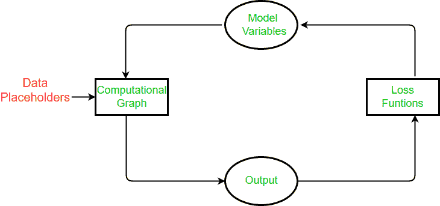

# 张量流张量介绍

> 原文:[https://www . geesforgeks . org/introduction-tensorflow/](https://www.geeksforgeeks.org/introduction-tensor-tensorflow/)

TensorFlow 是一个开源软件库，用于跨一系列任务的数据流编程。这是一个符号数学库，也用于机器学习应用，如神经网络。谷歌在 2015 年 11 月开源了 TensorFlow。此后，TensorFlow 成为 Github 上最具明星效应的机器学习资源库。(https://github.com/tensorflow/tensorflow)

为什么是张量流？TensorFlow 的流行有很多原因，但主要是因为计算图概念、自动微分以及 Tensorflow python API 结构的适应性。这使得大多数程序员都可以用 TensorFlow 解决实际问题。

谷歌的 Tensorflow 引擎有一种独特的解决问题的方法。这种独特的方法可以非常有效地解决机器学习问题。我们将介绍了解张量流如何工作的基本步骤。

**张量流中的张量是什么**

张量流，顾名思义，是一个定义和运行涉及张量的计算的框架。张量是向量和矩阵向潜在更高维度的推广。在内部，张量流将张量表示为基本数据类型的 n 维数组。张量中的每个元素都有相同的数据类型，并且数据类型总是已知的。形状(即它的维数和每个维数的大小)可能只是部分已知。如果输入的形状也是完全已知的，大多数运算都会产生完全已知形状的张量，但在某些情况下，只有在图形执行时才能找到张量的形状。

### 通用张量流算法概述

这里我们将介绍张量流算法的一般流程。

1.  **Import or generate data**

    我们所有的机器学习算法都将依赖于数据。实际上，我们要么生成数据，要么使用外部数据源。有时依赖生成的数据更好，因为我们想知道预期的结果。此外，tensorflow 还预装了著名的数据集，如 MNIST、CIFAR-10 等。

2.  **Transform and normalize data**

    数据通常不是我们的张量流算法所期望的正确维度或类型。我们必须先转换数据，然后才能使用它。大多数算法也期望标准化数据。Tensorflow 内置了可以为您规范化数据的函数。

    ```
    data = tf.nn.batch_norm_with_global_normalization(...)
    ```

3.  **Set algorithm parameters**

    我们的算法通常有一组参数，在整个过程中保持不变。例如，这可以是迭代次数、学习速率或我们选择的其他固定参数。将它们一起初始化被认为是好的形式，这样读者或用户可以很容易地找到它们。

    ```
    learning_rate = 0.001  iterations = 1000
    ```

4.  **Initialize variables and placeholders**

    张量流依赖于我们告诉它什么可以修改，什么不能修改。张量流将在优化过程中修改变量，以最小化损失函数。为了实现这一点，我们通过占位符输入数据。我们需要用大小和类型初始化这两个变量和占位符，这样 Tensorflow 就知道会发生什么。

    ```
    a_var = tf.constant(42)  x_input = tf.placeholder(tf.float32, [None, input_size])  y_input = tf.placeholder(tf.fload32, [None, num_classes])
    ```

5.  **Define the model structure**

    在我们有了数据，并且初始化了我们的变量和占位符之后，我们必须定义模型。这是通过构建一个计算图来完成的。我们告诉张量流必须对变量和占位符进行什么操作才能得到我们的模型预测。

    ```
    y_pred = tf.add(tf.mul(x_input, weight_matrix), b_matrix)
    ```

6.  **Declare the loss functions**

    定义模型后，我们必须能够评估输出。这是我们声明损失函数的地方。损失函数非常重要，因为它告诉我们预测值离实际值有多远。

    ```
    loss = tf.reduce_mean(tf.square(y_actual – y_pred))
    ```

7.  **Initialize and train the model**

    现在我们已经准备好了一切，我们创建一个实例或我们的图，并通过占位符输入数据，让 Tensorflow 更改变量，以更好地预测我们的训练数据。这里有一种初始化计算图的方法。

    ```
    with tf.Session(graph=graph) as session:
     ...
     session.run(...)
     ...
    ```

    请注意，我们也可以用以下内容来启动我们的图表

    ```
    session = tf.Session(graph=graph)  session.run(…)
    ```

8.  **Evaluate the model(Optional)**

    一旦我们构建并训练了模型，我们就应该通过一些特定的标准来评估模型在新数据上的表现。

9.  **Predict new outcomes(Optional)**

    知道如何对新的、看不见的数据进行预测也很重要。一旦我们对所有模型进行了培训，我们就可以对它们进行测试。

### 摘要

在 Tensorflow 中，我们必须先设置数据、变量、占位符和模型，然后告诉程序训练和更改变量以提高预测。张量流通过计算图实现这一点。我们告诉它最小化损失函数，张量流通过修改模型中的变量来做到这一点。张量流知道如何修改变量，因为它跟踪模型中的计算，并自动计算每个变量的梯度。正因为如此，我们可以看到进行更改和尝试不同的数据源是多么容易。

总的来说，算法被设计成在张量流中是循环的。我们将此循环设置为计算图，并(1)通过占位符输入数据，(2)计算计算图的输出，(3)使用损失函数将输出与所需输出进行比较，(4)根据自动反向传播修改模型变量，最后(5)重复该过程，直到满足停止标准。


现在开始使用张量流并使用它实现张量的实际会话。

首先，我们需要导入所需的库。

```
import tensorflow as tf
from tensorflow.python.framework import ops
ops.reset_default_graph()
```

然后开始图形会话

```
sess = tf.Session()
```

现在是主要部分，即创建张量。

张量流内置了创建用于变量的张量的函数。例如，我们可以使用 tf.zeros()函数创建预定义形状的零填充张量，如下所示。

```
my_tensor = tf.zeros([1,20])
```

我们可以通过在会话中调用 run()方法来计算张量。

```
sess.run(my_tensor)
```

张量流算法需要知道哪些对象是变量，哪些是常数。所以我们用 TensorFlow 函数 tf 创建了一个变量。变量()。请注意，您不能运行 sess.run(my_var)，这将导致错误。因为 TensorFlow 使用计算图进行操作，所以我们必须创建一个变量初始化操作来评估变量。对于这个脚本，我们可以通过调用变量方法 my_var.initializer 一次初始化一个变量。

```
my_var = tf.Variable(tf.zeros([1,20]))
sess.run(my_var.initializer)
sess.run(my_var)

```

输出:

```
array([[ 0.,  0.,  0.,  0.,  0.,  0.,  0.,  
              0.,  0.,  0.,  0.,  0.,  0.,  0.,  
              0.,  0.,  0.,  0.,  0.,  0.]], dtype=float32)
```

现在让我们创建我们的变量来处理具有特定形状的维度，然后用所有的“1”或“0”初始化变量

```
row_dim = 2
col_dim = 3
zero_var = tf.Variable(tf.zeros([row_dim, col_dim]))
ones_var = tf.Variable(tf.ones([row_dim, col_dim]))

```

现在评估它们的值，我们可以再次对变量运行初始化方法。

```
sess.run(zero_var.initializer)
sess.run(ones_var.initializer)
print(sess.run(zero_var))
print(sess.run(ones_var))
```

输出:

```
[[ 0\.  0\.  0.]
 [ 0\.  0\.  0.]]
[[ 1\.  1\.  1.]
 [ 1\.  1\.  1.]]
```

这份名单还会继续。剩下的就交给你学习了，跟着我这个 jupyter 笔记本从[这里](https://drive.google.com/open?id=1ictRcGZT4BRzPw11m4l0X3GE3hOewRIJ)获取更多张量的信息。

**在 TensorBoard 中可视化变量创建**

为了可视化张量板中变量的创建，我们将重置计算图并创建一个全局初始化操作。

```
# Reset graph
ops.reset_default_graph()

# Start a graph session
sess = tf.Session()

# Create variable
my_var = tf.Variable(tf.zeros([1,20]))

# Add summaries to tensorboard
merged = tf.summary.merge_all()

# Initialize graph writer:
writer = tf.summary.FileWriter("/tmp/variable_logs", graph=sess.graph)

# Initialize operation
initialize_op = tf.global_variables_initializer()

# Run initialization of variable
sess.run(initialize_op)
```

现在在 cmd 中运行以下命令。

```
tensorboard --logdir=/tmp
```

它会告诉我们网址，我们可以浏览我们的浏览器，看到张量板，以实现您的损失图表。

代码来创建所有类型的张量并对它们求值。

```
import tensorflow as tf
from tensorflow.python.framework import ops
ops.reset_default_graph()

# Introduce tensors in tf

# Get graph handle
sess = tf.Session()

my_tensor = tf.zeros([1,20])

# Declare a variable
my_var = tf.Variable(tf.zeros([1,20]))

# Different kinds of variables
row_dim = 2
col_dim = 3 

# Zero initialized variable
zero_var = tf.Variable(tf.zeros([row_dim, col_dim]))

# One initialized variable
ones_var = tf.Variable(tf.ones([row_dim, col_dim]))

# shaped like other variable
sess.run(zero_var.initializer)
sess.run(ones_var.initializer)
zero_similar = tf.Variable(tf.zeros_like(zero_var))
ones_similar = tf.Variable(tf.ones_like(ones_var))

sess.run(ones_similar.initializer)
sess.run(zero_similar.initializer)

# Fill shape with a constant
fill_var = tf.Variable(tf.fill([row_dim, col_dim], -1))

# Create a variable from a constant
const_var = tf.Variable(tf.constant([8, 6, 7, 5, 3, 0, 9]))
# This can also be used to fill an array:
const_fill_var = tf.Variable(tf.constant(-1, shape=[row_dim, col_dim]))

# Sequence generation
linear_var = tf.Variable(tf.linspace(start=0.0, stop=1.0, num=3)) # Generates [0.0, 0.5, 1.0] includes the end

sequence_var = tf.Variable(tf.range(start=6, limit=15, delta=3)) # Generates [6, 9, 12] doesn't include the end

# Random Numbers

# Random Normal
rnorm_var = tf.random_normal([row_dim, col_dim], mean=0.0, stddev=1.0)

# Add summaries to tensorboard
merged = tf.summary.merge_all()

# Initialize graph writer:

writer = tf.summary.FileWriter("/tmp/variable_logs", graph=sess.graph)

# Initialize operation
initialize_op = tf.global_variables_initializer()

# Run initialization of variable
sess.run(initialize_op)
```

输出:


参考链接:

1)[tensorlow 文件](https://www.tensorflow.org/)