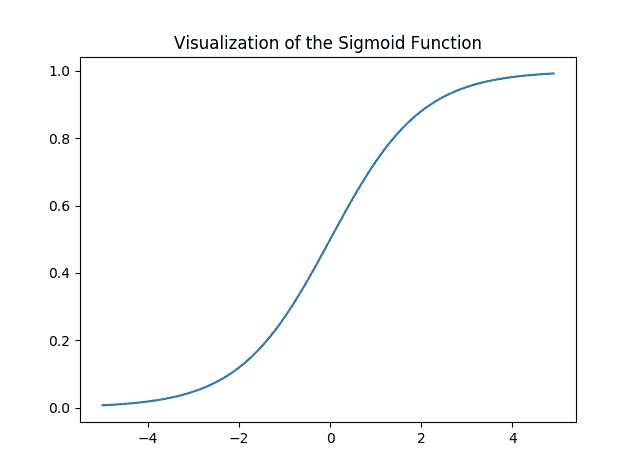
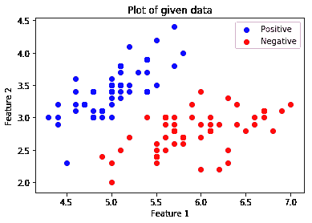
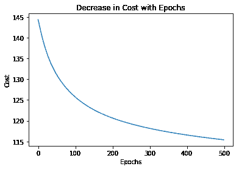
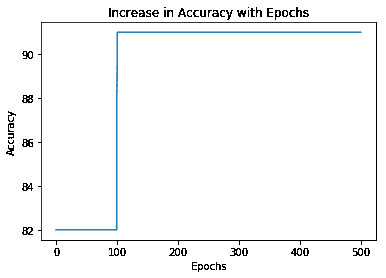

# ML |使用张量流的逻辑回归

> 原文:[https://www . geesforgeks . org/ml-logistic-回归-使用-tensorflow/](https://www.geeksforgeeks.org/ml-logistic-regression-using-tensorflow/)

先决条件:[理解逻辑回归](https://www.geeksforgeeks.org/understanding-logistic-regression/)和[张量流](https://www.geeksforgeeks.org/introduction-to-tensorflow/)。

**Logistic 回归简要概述:**
Logistic 回归是机器学习中常用的分类算法。它允许通过从给定的一组标记数据中学习关系，将数据分类到离散的类中。它从给定的数据集学习线性关系，然后以 Sigmoid 函数的形式引入非线性。

在逻辑回归的情况下，假设是直线的 Sigmoid，即

其中向量`w`代表权重，标量`b`代表模型的偏差。
让我们想象一下 Sigmoid 函数–

```
import numpy as np
import matplotlib.pyplot as plt

def sigmoid(z):
    return 1 / (1 + np.exp( - z))

plt.plot(np.arange(-5, 5, 0.1), sigmoid(np.arange(-5, 5, 0.1)))
plt.title('Visualization of the Sigmoid Function')

plt.show()
```

**输出:**

注意，Sigmoid 函数的范围是(0，1)，这意味着结果值在 0 和 1 之间。Sigmoid 函数的这一特性使它成为二元分类中激活函数的一个很好的选择。还有`for z = 0, Sigmoid(z) = 0.5`，它是 Sigmoid 函数范围的中点。

就像线性回归一样，我们需要找到成本函数 *J* 最小的 *w* 和 *b* 的最优值。在这种情况下，我们将使用由

给出的 Sigmoid 交叉熵成本函数，然后使用梯度下降来优化该成本函数。

**实现:**
我们将从导入必要的库开始。我们将使用 Numpy 和张量流进行计算，熊猫用于基本数据分析，Matplotlib 用于绘图。我们还将使用`Scikit-Learn`的预处理模块对数据进行一次热编码。

```
# importing modules
import numpy as np
import pandas as pd
import tensorflow as tf
import matplotlib.pyplot as plt
from sklearn.preprocessing import OneHotEncoder
```

接下来我们将导入[数据集](https://media.geeksforgeeks.org/wp-content/uploads/dataset.csv)。我们将使用著名的[虹膜数据集](https://www.kaggle.com/uciml/iris)的子集。

```
data = pd.read_csv('dataset.csv', header = None)
print("Data Shape:", data.shape)

print(data.head())
```

**输出:**

```
Data Shape: (100, 4)
   0    1    2  3
0  0  5.1  3.5  1
1  1  4.9  3.0  1
2  2  4.7  3.2  1
3  3  4.6  3.1  1
4  4  5.0  3.6  1
```

现在让我们得到特征矩阵和相应的标签并可视化。

```
# Feature Matrix
x_orig = data.iloc[:, 1:-1].values

# Data labels
y_orig = data.iloc[:, -1:].values

print("Shape of Feature Matrix:", x_orig.shape)
print("Shape Label Vector:", y_orig.shape)
```

**输出:**

```
Shape of Feature Matrix: (100, 2)
Shape Label Vector: (100, 1)
```

可视化给定的数据。

```
# Positive Data Points
x_pos = np.array([x_orig[i] for i in range(len(x_orig))
                                    if y_orig[i] == 1])

# Negative Data Points
x_neg = np.array([x_orig[i] for i in range(len(x_orig))
                                    if y_orig[i] == 0])

# Plotting the Positive Data Points
plt.scatter(x_pos[:, 0], x_pos[:, 1], color = 'blue', label = 'Positive')

# Plotting the Negative Data Points
plt.scatter(x_neg[:, 0], x_neg[:, 1], color = 'red', label = 'Negative')

plt.xlabel('Feature 1')
plt.ylabel('Feature 2')
plt.title('Plot of given data')
plt.legend()

plt.show()
```

。

现在我们将对数据进行一次热编码，以便它与算法一起工作。一种热编码将分类特征转换成一种更适合分类和回归算法的格式。我们还将设置学习率和时代数量。

```
# Creating the One Hot Encoder
oneHot = OneHotEncoder()

# Encoding x_orig
oneHot.fit(x_orig)
x = oneHot.transform(x_orig).toarray()

# Encoding y_orig
oneHot.fit(y_orig)
y = oneHot.transform(y_orig).toarray()

alpha, epochs = 0.0035, 500
m, n = x.shape
print('m =', m)
print('n =', n)
print('Learning Rate =', alpha)
print('Number of Epochs =', epochs)
```

**输出:**

```
m = 100
n = 7
Learning Rate = 0.0035
Number of Epochs = 500
```

现在，我们将通过定义占位符`X`和`Y`来开始创建模型，这样我们就可以在训练过程中将训练示例`x`和`y`输入到优化器中。我们还将创建可训练变量`W`和`b`，它们可以通过梯度下降优化器进行优化。

```
# There are n columns in the feature matrix
# after One Hot Encoding.
X = tf.placeholder(tf.float32, [None, n])

# Since this is a binary classification problem,
# Y can take only 2 values.
Y = tf.placeholder(tf.float32, [None, 2])

# Trainable Variable Weights
W = tf.Variable(tf.zeros([n, 2]))

# Trainable Variable Bias
b = tf.Variable(tf.zeros([2]))
```

现在声明假设、代价函数、优化器和全局变量初始化器。

```
# Hypothesis
Y_hat = tf.nn.sigmoid(tf.add(tf.matmul(X, W), b))

# Sigmoid Cross Entropy Cost Function
cost = tf.nn.sigmoid_cross_entropy_with_logits(
                    logits = Y_hat, labels = Y)

# Gradient Descent Optimizer
optimizer = tf.train.GradientDescentOptimizer(
         learning_rate = alpha).minimize(cost)

# Global Variables Initializer
init = tf.global_variables_initializer()
```

在张量流会话中开始训练过程。

```
# Starting the Tensorflow Session
with tf.Session() as sess:

    # Initializing the Variables
    sess.run(init)

    # Lists for storing the changing Cost and Accuracy in every Epoch
    cost_history, accuracy_history = [], []

    # Iterating through all the epochs
    for epoch in range(epochs):
        cost_per_epoch = 0

        # Running the Optimizer
        sess.run(optimizer, feed_dict = {X : x, Y : y})

        # Calculating cost on current Epoch
        c = sess.run(cost, feed_dict = {X : x, Y : y})

        # Calculating accuracy on current Epoch
        correct_prediction = tf.equal(tf.argmax(Y_hat, 1),
                                          tf.argmax(Y, 1))
        accuracy = tf.reduce_mean(tf.cast(correct_prediction,
                                                 tf.float32))

        # Storing Cost and Accuracy to the history
        cost_history.append(sum(sum(c)))
        accuracy_history.append(accuracy.eval({X : x, Y : y}) * 100)

        # Displaying result on current Epoch
        if epoch % 100 == 0 and epoch != 0:
            print("Epoch " + str(epoch) + " Cost: "
                            + str(cost_history[-1]))

    Weight = sess.run(W) # Optimized Weight
    Bias = sess.run(b)   # Optimized Bias

    # Final Accuracy
    correct_prediction = tf.equal(tf.argmax(Y_hat, 1),
                                      tf.argmax(Y, 1))
    accuracy = tf.reduce_mean(tf.cast(correct_prediction, 
                                             tf.float32))
    print("\nAccuracy:", accuracy_history[-1], "%")
```

**输出:**

```
Epoch 100 Cost: 125.700202942
Epoch 200 Cost: 120.647117615
Epoch 300 Cost: 118.151592255
Epoch 400 Cost: 116.549999237

Accuracy: 91.0000026226 %
```

让我们画出不同时期成本的变化。

```
plt.plot(list(range(epochs)), cost_history)
plt.xlabel('Epochs')
plt.ylabel('Cost')
plt.title('Decrease in Cost with Epochs')

plt.show()
```



绘制各个时期准确度的变化。

```
plt.plot(list(range(epochs)), accuracy_history)
plt.xlabel('Epochs')
plt.ylabel('Accuracy')
plt.title('Increase in Accuracy with Epochs')

plt.show()
```



现在，我们将为训练好的分类器绘制决策边界。决策边界是一个超曲面，它将基础向量空间分成两组，每组一个。

```
# Calculating the Decision Boundary
decision_boundary_x = np.array([np.min(x_orig[:, 0]),
                               np.max(x_orig[:, 0])])

decision_boundary_y = (- 1.0 / Weight[0]) *
      (decision_boundary_x * Weight + Bias)

decision_boundary_y = [sum(decision_boundary_y[:, 0]), 
                       sum(decision_boundary_y[:, 1])]

# Positive Data Points
x_pos = np.array([x_orig[i] for i in range(len(x_orig))
                                    if y_orig[i] == 1])

# Negative Data Points
x_neg = np.array([x_orig[i] for i in range(len(x_orig)) 
                                    if y_orig[i] == 0])

# Plotting the Positive Data Points
plt.scatter(x_pos[:, 0], x_pos[:, 1],
  color = 'blue', label = 'Positive')

# Plotting the Negative Data Points
plt.scatter(x_neg[:, 0], x_neg[:, 1],
   color = 'red', label = 'Negative')

# Plotting the Decision Boundary
plt.plot(decision_boundary_x, decision_boundary_y)
plt.xlabel('Feature 1')
plt.ylabel('Feature 2')
plt.title('Plot of Decision Boundary')
plt.legend()

plt.show()
```

