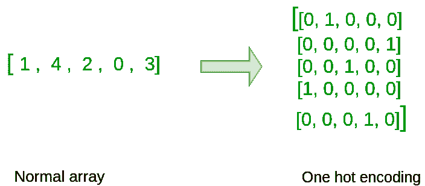

# 一个使用张量流的热编码

> 原文:[https://www . geesforgeks . org/one-hot-encoding-use-tensorflow/](https://www.geeksforgeeks.org/one-hot-encoding-using-tensorflow/)

在这篇文章中，我们将看到如何用全 0 或全 1 初始化张量流中的向量。你要调用的功能是`tf.ones()`。要用零初始化，可以用`tf.zeros()`代替。这些函数取一个形状，并相应地返回一个满是 0 和 1 的数组。

**代码:**

```
import tensorflow as tf

ones_matrix = tf.ones([2, 3])
sess = tf.Session()
ones = sess.run(ones_matrix)
sess.close()

print(ones)
```

**输出:**

```
[[1\. 1\. 1.]  [1\. 1\. 1.]]
```

**使用 One Hot Encoding:**
在深度学习和一般向量计算中，你会得到一个 y 向量，其数字范围从 0 到 C-1，你想要进行以下转换。例如，如果 C 是 5，那么你可能有下面的 y 向量，你需要转换如下:



一个热门编码示例

这可以通过以下方式实现:

**传递给函数的参数:**

> **指数:**指数张量。
> **深度:**定义一维深度的标量。
> **on_value:** 定义索引[j] = i 时填写输出的值的标量(默认:1)
> **off_value:** 定义索引[j]时填写输出的值的标量！= i(默认:0)
> **轴:**要填充的轴(默认:-1，新的最内部轴)。
> **数据类型:**输出张量的数据类型。
> **名称:**操作的名称(可选)。

**代码:**

```
indices = [1, 4, 2, 0, 3]
C = tf.constant(5, name = "C")

one_hot_matrix = tf.one_hot(
    indices, C, on_value = 1.0, off_value = 0.0, axis =-1)

sess = tf.Session()

one_hot = sess.run(one_hot_matrix)

sess.close()

# output is of dimension 5 x 5
print(one_hot)
```

**输出:**

```
[[0.0, 1.0, 0.0, 0.0, 0.0 ]

[0.0, 0.0, 0.0, 0.0, 1.0]

[0.0, 0.0, 1.0, 0.0, 0.0]

[1.0, 0.0, 0.0, 0.0, 0.0]

[0.0, 0.0, 0.0, 1.0, 0.0]]
```

随意改变价值观，看看结果。

**代码:**

```
indices = [[0, 2], [1, -1]]
C = tf.constant(5, name = "C")

one_hot_matrix = tf.one_hot(
    indices, C, on_value = 1.0, off_value = 0.0, axis =-1)

sess = tf.Session()

one_hot = sess.run(one_hot_matrix)

sess.close()

# output is of dimension 2 x 2 x 3
print(one_hot) 
```

**输出:**

```
[[[1.0, 0.0, 0.0],  

  [0.0, 0.0, 1.0]],  

 [[0.0, 1.0, 0.0],  

 [0.0, 0.0, 0.0]]] 
```