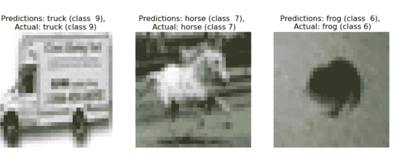
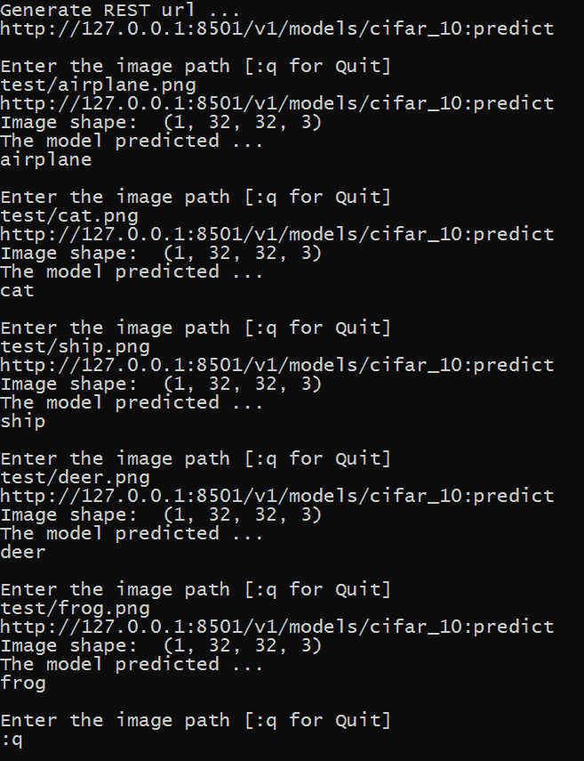
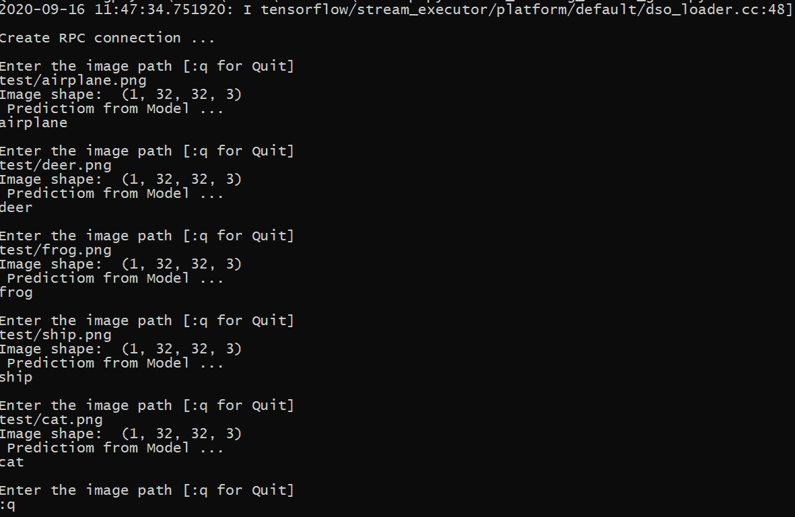

# Python–使用 TensorFlow 服务的模型部署

> 原文:[https://www . geesforgeks . org/python-model-deployment-use-tensorflow-serving/](https://www.geeksforgeeks.org/python-model-deployment-using-tensorflow-serving/)

机器学习管道最重要的部分是模型部署。模型部署意味着部署是一种方法，通过这种方法，您可以将机器学习模型集成到现有的生产环境中，以允许它实时用于实际的目的。

部署模型的方法有很多。一种方法是将一个模型与带有脚本的 Django/Flask 应用程序集成，该脚本接受输入、加载模型并生成结果。因此，我们可以轻松地将图像数据传递给模型，并在模型生成输出后显示结果。以下是上述方法的局限性:

*   根据模型的大小，处理输入和生成结果需要一些时间。
*   该模型不能用于其他应用程序。(考虑一下，我们不写任何 REST/gRPC API)。
*   与节点相比，Flask 中的输入/输出处理速度较慢。
*   训练模型也是资源密集型和耗时的(因为它需要大量的输入/输出和计算。

另一种方法是使用 TensorFlow 服务部署模型。由于它还提供了 API(以 REST 和 gRPC 的形式)，所以它是可移植的，可以通过使用它的 API 在不同的设备中使用。它易于部署，即使对于较大的模型也能很好地工作。

**TensorFlow 服务的优势:**

*   TensorFlow 扩展(TFX)生态系统的一部分。
*   适用于大型机型(高达 2 GB)。
*   为 RESTful 和 gRPC 客户端请求提供一致的 API 结构。
*   可以管理模型版本。
*   谷歌内部使用

**RESTful API:**

TensorFlow Serving 以 RESTful API 的形式支持两种类型的客户端请求格式。

*   对原料药进行分类和回归
*   预测应用编程接口(用于预测任务)

这里，我们将使用预测应用编程接口，其网址格式为:

```py
POST http://{host}:{port}/v1/models/${MODEL_NAME}[/versions/${VERSION}|/labels/${LABEL}]:predict
```

请求主体包含一个 JSON 对象，其形式为:

```py
{
  // (Optional) Serving signature to use.
  // default : 'serving-default'
  "signature_name": <string>,

 // Instance : for row format (list, array etc.), inputs: for columns format.
 // can have any one of them
  "instances": <value>|<(nested)list>|<list-of-objects>
  "inputs": <value>|<(nested)list>|<object>
}
```

**gRPC API:**

要使用 gRPC API，我们使用 pip 安装一个调用 tensorflow-serving-api 的包。代码中提供了关于 gRPC API 端点的更多详细信息。

**实施:**

*   我们将展示张量流服务的能力。首先，我们导入(或安装)必要的模块，然后我们将在 CIFAR 10 数据集上将模型训练到 100 个时期。为了生产使用，我们可以将此文件保存为 train.py

**代码:**

## 蟒蛇 3

```py
# General import
!pip install -Uq grpcio==1.26.0
import numpy as np
import matplotlib.pyplot as plt
import os
import subprocess
import requests
import json

# TensorFlow Imports
from tensorflow import keras
from tensorflow.keras.layers import Conv2D, MaxPooling2D, Flatten,Dense, Dropout
from tensorflow.keras.models import Sequential,save_model
from tensorflow.keras.optimizers import SGD
from tensorflow.keras.utils import to_categorical
from tensorflow.keras.datasets import cifar10

class_names =["airplane","automobile","bird","cat","deer","dog",
              "frog","horse", "ship","truck"]
# load  and preprocessdataset
def load_and_preprocess():
  (x_train, y_train), (x_test,y_test) = cifar_10.load_data()
  y_train  = to_categorical(y_train)
  y_test  = to_categorical(y_test)
  x_train = x_train.astype('float32')
  x_test = x_test.astype('float32')
  x_train = x_train/255
  x_test = x_test/255
  return (x_train, y_train), (x_test,y_test)

# define model architecture
def get_model():
    model  = Sequential([
      Conv2D(32, (3, 3), activation='relu', padding='same', input_shape=(32, 32, 3)),
      Conv2D(32, (3, 3), activation='relu', padding='same'),
      MaxPooling2D((2, 2)),
      Dropout(0.2),
      Conv2D(64, (3, 3), activation='relu', padding='same'),
      Conv2D(64, (3, 3), activation='relu', padding='same'),
      MaxPooling2D((2, 2)),
      Dropout(0.2),
      Flatten(),
      Dense(64, activation='relu'),
      Dense(10, activation='softmax')
    ])

    model.compile(
      optimizer=SGD(learning_rate= 0.01 , momentum=0.1),
      loss='categorical_crossentropy',
      metrics=['accuracy']
    )
    model.summary()
    return model
# train model
model = get_model()
model.fit(
    x_train,
    y_train,
    epochs=100,
    validation_data=(x_test, y_test),
```

```py
Model: "sequential_1"
_________________________________________________________________
Layer (type)                 Output Shape              Param #   
=================================================================
conv2d_4 (Conv2D)            (None, 32, 32, 32)        896       
_________________________________________________________________
conv2d_5 (Conv2D)            (None, 32, 32, 32)        9248      
_________________________________________________________________
max_pooling2d_2 (MaxPooling2 (None, 16, 16, 32)        0         
_________________________________________________________________
dropout_2 (Dropout)          (None, 16, 16, 32)        0         
_________________________________________________________________
conv2d_6 (Conv2D)            (None, 16, 16, 64)        18496     
_________________________________________________________________
conv2d_7 (Conv2D)            (None, 16, 16, 64)        36928     
_________________________________________________________________
max_pooling2d_3 (MaxPooling2 (None, 8, 8, 64)          0         
_________________________________________________________________
dropout_3 (Dropout)          (None, 8, 8, 64)          0         
_________________________________________________________________
flatten_1 (Flatten)          (None, 4096)              0         
_________________________________________________________________
dense_2 (Dense)              (None, 64)                262208    
_________________________________________________________________
dense_3 (Dense)              (None, 10)                650       
=================================================================
Total params: 328,426
Trainable params: 328,426
Non-trainable params: 0
_________________________________________________________________
Epoch 1/100
1563/1563 [==============================] - 7s 
5ms/step - loss: 2.0344 - accuracy: 0.2537 - val_loss: 1.7737 - val_accuracy: 0.3691
Epoch 2/100
1563/1563 [==============================] - 7s 
4ms/step - loss: 1.6704 - accuracy: 0.4036 - val_loss: 1.5645 - val_accuracy: 0.4289
Epoch 3/100
1563/1563 [==============================] - 7s 
4ms/step - loss: 1.4688 - accuracy: 0.4723 - val_loss: 1.3854 - val_accuracy: 0.4999
Epoch 4/100
1563/1563 [==============================] - 7s 
4ms/step - loss: 1.3209 - accuracy: 0.5288 - val_loss: 1.2357 - val_accuracy: 0.5540
Epoch 5/100
1563/1563 [==============================] - 7s 
4ms/step - loss: 1.2046 - accuracy: 0.5699 - val_loss: 1.1413 - val_accuracy: 0.5935
Epoch 6/100
1563/1563 [==============================] - 7s 
4ms/step - loss: 1.1088 - accuracy: 0.6082 - val_loss: 1.2331 - val_accuracy: 0.5572
Epoch 7/100
1563/1563 [==============================] - 7s 
4ms/step - loss: 1.0248 - accuracy: 0.6373 - val_loss: 1.0139 - val_accuracy: 0.6389
Epoch 8/100
1563/1563 [==============================] - 7s 
4ms/step - loss: 0.9613 - accuracy: 0.6605 - val_loss: 0.9723 - val_accuracy: 0.6577
.
.
.
.
.

Epoch 90/100
1563/1563 [==============================] - 7s 
4ms/step - loss: 0.0775 - accuracy: 0.9734 - val_loss: 1.3356 - val_accuracy: 0.7473
Epoch 91/100
1563/1563 [==============================] - 7s 
4ms/step - loss: 0.0739 - accuracy: 0.9740 - val_loss: 1.2990 - val_accuracy: 0.7681
Epoch 92/100
1563/1563 [==============================] - 7s 
4ms/step - loss: 0.0743 - accuracy: 0.9739 - val_loss: 1.2629 - val_accuracy: 0.7655
Epoch 93/100
1563/1563 [==============================] - 7s 
4ms/step - loss: 0.0740 - accuracy: 0.9743 - val_loss: 1.3276 - val_accuracy: 0.7635
Epoch 94/100
1563/1563 [==============================] - 7s 
4ms/step - loss: 0.0724 - accuracy: 0.9746 - val_loss: 1.3179 - val_accuracy: 0.7656
Epoch 95/100
1563/1563 [==============================] - 7s 
4ms/step - loss: 0.0737 - accuracy: 0.9740 - val_loss: 1.3039 - val_accuracy: 0.7677
Epoch 96/100
1563/1563 [==============================] - 7s 
4ms/step - loss: 0.0736 - accuracy: 0.9734 - val_loss: 1.3243 - val_accuracy: 0.7653
Epoch 97/100
1563/1563 [==============================] - 7s 
4ms/step - loss: 0.0704 - accuracy: 0.9756 - val_loss: 1.3264 - val_accuracy: 0.7660
Epoch 98/100
1563/1563 [==============================] - 7s 
4ms/step - loss: 0.0693 - accuracy: 0.9757 - val_loss: 1.3284 - val_accuracy: 0.7658
Epoch 99/100
1563/1563 [==============================] - 7s 
4ms/step - loss: 0.0668 - accuracy: 0.9764 - val_loss: 1.3649 - val_accuracy: 0.7636
Epoch 100/100
1563/1563 [==============================] - 7s 
5ms/step - loss: 0.0710 - accuracy: 0.9749 - val_loss: 1.3206 - val_accuracy: 0.7682
<tensorflow.python.keras.callbacks.History at 0x7f36a042e7f0>
```

*   然后我们使用 TensorFlow save_model()将模型保存在 temp 文件夹中，并将其导出到 Tar Gz 进行下载。

**代码:**

## 蟒蛇 3

```py
import tempfile

MODEL_DIR = tempfile.gettempdir()
version = 1
export_path = os.path.join(MODEL_DIR, str(version))
print('export_path = {}\n'.format(export_path))

save_model(
    model,
    export_path,
    overwrite=True,
    include_optimizer=True
)

print('\nSaved model:')
!ls -l {export_path}

# The command display input and output kayers with signature and data type
# These details are required when we make gRPC API call
!saved_model_cli show --dir {export_path} --all

# Create a compressed model from the savedmodel  .
!tar -cz -f model.tar.gz --owner=0 --group=0 -C /tmp/1/ .
```

*   现在，我们将使用 TensorFlow Serving 托管模型，我们将使用两种方法演示托管。

*   首先，我们将利用 colab 环境，并在该环境中安装 TensorFlow Serving
*   然后，我们将使用 docker 环境来托管模型，并使用 gRPC 和 REST API 来调用模型并获得预测。现在，我们将实现第一种方法。

**代码:**

## 蟒蛇 3

```py
# Install TensorFlow Serving using Aptitude [For Debian]
!echo "deb http://storage.googleapis.com/tensorflow-serving-apt"
"stable tensorflow-model-server tensorflow-model-server-universal" |
    tee /etc/apt/sources.list.d/tensorflow-serving.list && \
!curl https://storage.googleapis.com/tensorflow-serving-apt/tensorflow-serving.release.pub.gpg
    | apt-key add -
!apt update
# Install TensorFlow Server
!apt-get install tensorflow-model-server

# Run TensorFlow Serving on a new thread

os.environ["MODEL_DIR"] = MODEL_DIR

%%bash --bg
nohup tensorflow_model_server \
  --rest_api_port=8501 \
  --model_name=cifar_10 \
  --model_base_path="${MODEL_DIR}" >server.log 2>&1
```

```py
Starting job # 0 in a separate thread.
```

*   现在，我们定义了向服务器发出 REST API 请求的函数。这将从测试数据集中获取随机图像，并将其发送到模型(以 JSON 格式)。然后，模型以 JSON 格式返回预测。



*   现在，我们将在 Docker 环境中运行我们的模型。它同时支持 CPU 和 GPU 架构，也是 TensorFlow 的开发者推荐的。对于服务模型，它提供了一个 REST (def PORT: 8501)和 gRPC[远程过程调用] (def PORT: 8500)端点与模型通信。我们将使用以下命令在 docker 上托管我们的模型。

**代码:**

## 蟒蛇 3

```py
# To TensorFlow Image from Docker Hub
!docker pull tensorflow/serving
# Run our model
!docker run -p 8500:8500 -p 8501:8501 \
  --mount type=bind,source=`pwd`/cifar_10/,target=/models/cifar_10 \
  -e MODEL_NAME=cifar_10 -t tensorflow/serving
```

*   现在，我们需要编写一个脚本，使用 REST 和 gRPC 端点与我们的模型进行通信。下面是 REST 端点的脚本。保存这段代码，并使用 python 在终端中运行。从 CIFAR-10 数据集下载一些图像并测试结果

**代码:**

## 蟒蛇 3

```py
import json
import requests
import sys
from PIL import Image
import numpy as np

def get_rest_url(model_name, host='127.0.0.1',
                 port='8501', task='predict', version=None):
    """ This function takes hostname, port, task (b/w predict and classify)
    and version to generate generate the URL path for REST API"""
    # Our REST URL should be http://127.0.0.1:8501/v1/models/cifar_10/predict
    url = "http://{host}:{port}/v1/models/{model_name}".format(host=host,
     port=port, model_name=model_name)
    if version:
        url += 'versions/{version}'.format(version=version)
    url += ':{task}'.format(task=task)
    return url

def get_model_prediction(model_input, model_name='cifar_10',
                         signature_name='serving_default'):
    """ This function sends request to the URL and get prediction
    in the form of response"""
    url = get_rest_url(model_name)
    image = Image.open(model_input)
    # convert image to array
    im =  np.asarray(image)
    # add the 4th dimension
    im = np.expand_dims(im, axis=0)
    im= im/255
    print("Image shape: ",im.shape)
    data = json.dumps({"signature_name": "serving_default",
                       "instances": im.tolist()})
    headers = {"content-type": "application/json"}
    # Send the post request and get response   
    rv = requests.post(url, data=data, headers=headers)
    return rv.json()['predictions']

if __name__ == '__main__':
    class_names =["airplane","automobile","bird","cat","deer"
    ,"dog","frog","horse", "ship","truck"]
    print("\nGenerate REST url ...")
    url = get_rest_url(model_name='cifar_10')
    print(url)

    while True:
        print("\nEnter the image path [:q for Quit]")
        if sys.version_info[0] >= 3:
            path = str(input())
        if path == ':q':
            break
        model_prediction = get_model_prediction(path)
        print("The model predicted ...")
        print(class_names[np.argmax(model_prediction)])
```



*   和 gRPC 请求下面的代码。在这里，获得正确的签名名称(默认情况下是“服务默认值”)以及输入和输出图层的名称非常重要。

**代码:**

## 蟒蛇 3

```py
import sys
import grpc
from grpc.beta import implementations
import tensorflow as tf
from PIL import Image
import numpy as np
# import prediction service functions from TF-Serving API
from tensorflow_serving.apis import predict_pb2
from tensorflow_serving.apis import prediction_service_pb2, get_model_metadata_pb2
from tensorflow_serving.apis import prediction_service_pb2_grpc

def get_stub(host='127.0.0.1', port='8500'):
    channel = grpc.insecure_channel('127.0.0.1:8500')
    stub = prediction_service_pb2_grpc.PredictionServiceStub(channel)
    return stub

def get_model_prediction(model_input, stub, model_name='cifar_10', signature_name='serving_default'):
    """ input => (image path, url, model_name, signature)
        output the results in the form of tf.array"""

    image = Image.open(model_input)
    im =  np.asarray(image, dtype=np.float64)
    im = (im/255)
    im = np.expand_dims(im, axis=0)

    print("Image shape: ",im.shape)
    # We will be using Prediction Task so it uses predictRequest function from predict_pb2

    request = predict_pb2.PredictRequest()
    request.model_spec.name = model_name
    request.model_spec.signature_name = signature_name
    #pass Image input to input layer (Here it is named 'conv2d_4_input')
    request.inputs['conv2d_4_input'].CopyFrom(tf.make_tensor_proto(im, dtype = tf.float32))

    response = stub.Predict.future(request, 5.0)
    # get results from final layer(dense_3)
    return response.result().outputs["dense_3"].float_val

def get_model_version(model_name, stub):
    request = get_model_metadata_pb2.GetModelMetadataRequest()
    request.model_spec.name = 'cifar_10'
    request.metadata_field.append("signature_def")
    response = stub.GetModelMetadata(request, 10)
    # signature of loaded model is available here: response.metadata['signature_def']
    return response.model_spec.version.value

if __name__ == '__main__':
    class_names =["airplane","automobile","bird","cat","deer","dog","frog","horse", "ship","truck"]
    print("\nCreate RPC connection ...")
    stub = get_stub()
    while True:
        print("\nEnter the image path [:q for Quit]")
        if sys.version_info[0] <= 3:
            path = raw_input() if sys.version_info[0] < 3 else input()
        if path == ':q':
            break
        model_input = str(path)
        model_prediction = get_model_prediction(model_input, stub)
        print(" Predictiom from Model ...")
        print(class_names[np.argmax(model_prediction)])
```



**参考文献:**

*   [TensorFlow 服务单据](https://www.tensorflow.org/tfx/guide/serving)