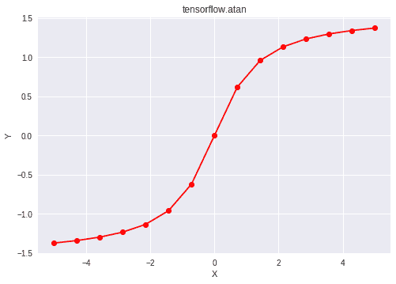

# Python | Tensorflow atan()方法

> 原文:[https://www . geesforgeks . org/python-tensorflow-atan-method/](https://www.geeksforgeeks.org/python-tensorflow-atan-method/)

[Tensorflow](https://www.geeksforgeeks.org/introduction-to-tensorflow/) 是谷歌开发的开源机器学习库。其应用之一是开发深度神经网络。
模块 **tensorflow.math** 为许多基本的数学运算提供支持。函数 TF . atan()[别名 tf.math.atan]为 Tensorflow 中的*反正切*函数提供支持。它以弧度形式给出输出。输入类型是张量，如果输入包含多个元素，则计算元素方向的反正切。

> **语法** : tf.atan(x，name=None)或 tf.math.atan(x，name=None)
> **参数** :
> **x** :以下任一类型的张量:bfloat16、half、float32、float64、int32、int64、complex64 或 complex128。
> **名称**(可选):操作的名称。
> **返回类型**:与 x 类型相同的张量。

**代码#1:**

## 蟒蛇 3

```
# Importing the Tensorflow library
import tensorflow as tf

# A constant vector of size 6
a = tf.constant([1.0, -0.5, 3.4, 0.2, 0.0, -2],
                           dtype = tf.float32)

# Applying the atan function and
# storing the result in 'b'
b = tf.atan(a, name ='atan')

# Initiating a Tensorflow session
with tf.Session() as sess:
    print('Input type:', a)
    print('Input:', sess.run(a))
    print('Return type:', b)
    print('Output:', sess.run(b))
```

**输出:**

```
Input type: Tensor("Const_8:0", shape=(6, ), dtype=float32)
Input: [ 1\.  -0.5  3.4  0.2  0\.  -2\. ]
Return type: Tensor("atan:0", shape=(6, ), dtype=float32)
Output: [ 0.7853982  -0.4636476   1.2847449   0.19739556  0\.         -1.1071488 ]
```

**代码#2:** 可视化

## 蟒蛇 3

```
# Importing the Tensorflow library
import tensorflow as tf

# Importing the NumPy library
import numpy as np

# Importing the matplotlib.pyplot function
import matplotlib.pyplot as plt

# A vector of size 15 with values from -5 to 5
a = np.linspace(-5, 5, 15)

# Applying the inverse tangent function and
# storing the result in 'b'
b = tf.atan(a, name ='atan')

# Initiating a Tensorflow session
with tf.Session() as sess:
    print('Input:', a)
    print('Output:', sess.run(b))
    plt.plot(a, sess.run(b), color = 'red', marker = "o")
    plt.title("tensorflow.atan")
    plt.xlabel("X")
    plt.ylabel("Y")

    plt.show()
```

**输出:**

```
Input: [-5\.         -4.28571429 -3.57142857 -2.85714286 -2.14285714 -1.42857143
 -0.71428571  0\.          0.71428571  1.42857143  2.14285714  2.85714286
  3.57142857  4.28571429  5\.        ]
Output: [-1.37340077 -1.34156439 -1.29778762 -1.23412151 -1.13416917 -0.96007036
 -0.62024949  0\.          0.62024949  0.96007036  1.13416917  1.23412151
  1.29778762  1.34156439  1.37340077]
```

