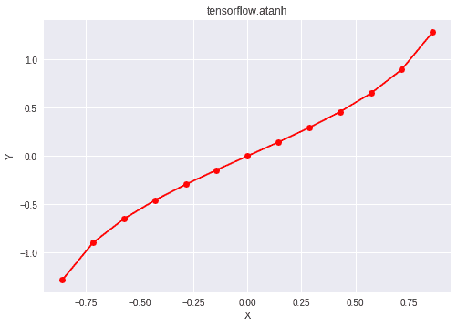

# Python | Tensorflow atanh()方法

> 原文:[https://www . geesforgeks . org/python-tensorflow-atanh-method/](https://www.geeksforgeeks.org/python-tensorflow-atanh-method/)

[Tensorflow](https://www.geeksforgeeks.org/introduction-to-tensorflow/) 是谷歌开发的开源机器学习库。其应用之一是开发深度神经网络。

模块`**tensorflow.math**`为许多基本的数学运算提供支持。功能`tf.atanh()`【别名`tf.math.atanh`】支持张量流中的*反双曲正切*功能。其域在[-1，1]范围内，对于该范围之外的任何输入，它返回 *nan* 。输入类型是张量，如果输入包含一个以上的元素，则计算元素方向的反双曲正切。

> **语法** : tf.atanh(x，名称=无)或 tf.math.atanh(x，名称=无)
> 
> **参数** :
> **x** :以下任一类型的张量:float16、float32、float64、complex64 或 complex128。
> **名称**(可选):操作的名称。
> 
> **返回类型**:与 x 类型相同的张量。

**代码#1:**

## 蟒蛇 3

```py
# Importing the Tensorflow library
import tensorflow as tf

# A constant vector of size 6
a = tf.constant([1.0, -0.5, -1, 2.4, 0.0, -6.5], dtype = tf.float32)

# Applying the atanh function and
# storing the result in 'b'
b = tf.atanh(a, name ='atanh')

# Initiating a Tensorflow session
with tf.Session() as sess:
    print('Input type:', a)
    print('Input:', sess.run(a))
    print('Return type:', b)
    print('Output:', sess.run(b))
```

**输出:**

```py
Input type: Tensor("Const_3:0", shape=(6, ), dtype=float32)
Input: [ 1\.  -0.5 -1\.   2.4  0\.  -6.5]
Return type: Tensor("atanh_1:0", shape=(6, ), dtype=float32)
Output: [        inf -0.54930615        -inf         nan  0\.                 nan]

```

**代码#2:** 可视化

## 蟒蛇 3

```py
# Importing the Tensorflow library
import tensorflow as tf

# Importing the NumPy library
import numpy as np

# Importing the matplotlib.pylot function
import matplotlib.pyplot as plt

# A vector of size 15 with values from -1 to 1
a = np.linspace(-1, 1, 15)

# Applying the inverse hyperbolic tangent
# function and storing the result in 'b'
b = tf.atanh(a, name ='atanh')

# Initiating a Tensorflow session
with tf.Session() as sess:
    print('Input:', a)
    print('Output:', sess.run(b))
    plt.plot(a, sess.run(b), color = 'red', marker = "o") 
    plt.title("tensorflow.atanh") 
    plt.xlabel("X") 
    plt.ylabel("Y") 

    plt.show()
```

**Output:**

```py
Input: [-1\.         -0.85714286 -0.71428571 -0.57142857 -0.42857143 -0.28571429
 -0.14285714  0\.          0.14285714  0.28571429  0.42857143  0.57142857
  0.71428571  0.85714286  1\.        ]
Output: [       -inf -1.28247468 -0.89587973 -0.64964149 -0.45814537 -0.29389333
 -0.14384104  0\.          0.14384104  0.29389333  0.45814537  0.64964149
  0.89587973  1.28247468         inf]

```

