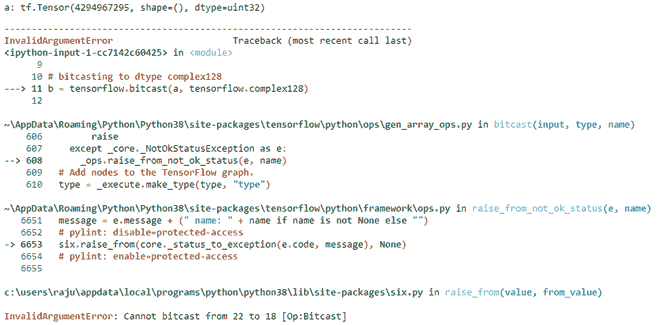

# Python | tensorflow.bitcast()方法

> 原文:[https://www . geesforgeks . org/python-tensorflow-bit cast-method/](https://www.geeksforgeeks.org/python-tensorflow-bitcast-method/)

[TensorFlow](https://www.geeksforgeeks.org/introduction-to-tensorflow/) 是谷歌为开发机器学习模型和深度学习神经网络而设计的开源 python 库。

bitcast()是 tensorflow 库中的一种方法，用于将张量从一种类型 bitcast 到另一种类型。它不会复制数据。

```
Syntax:
tf.bitcast(
    input, type, name
)

Arguments: 
1\. input: It is the Tensor and the allowed type for this tensor are
          bfloat16, half, float32, float64, int64, int32, uint8, uint16, uint32,
 uint64, int8, int16, complex64, complex128, qint8, quint8, qint16, quint16, qint32.
2\. type: It defines the dtype in which input need to be bitcasted.
3\. name: It is an optional argument. It is used to give a name to operation.

Return: It returns a tensor of type type.

```

**注意:** bitcast 不能用于将真实的 dtype 转换为复杂的 dtype。它将引发无效的文档恐怖。

**例 1:**

## 蟒蛇 3

```
# importing the library
import tensorflow

# initializing the constant tensor of dtype unit32
a = tensorflow.constant(0xffffffff, dtype=tensorflow.uint32)

# Checking the initialized tensor
print('a:',a)

# bitcasting to dtype unit8
b = tensorflow.bitcast(a, tensorflow.uint8)

# Checking the bitcasted tensor
print('b:',b)
```

**输出:**

```
a: tf.Tensor(4294967295, shape=(), dtype=uint32)
b: tf.Tensor([255 255 255 255], shape=(4,), dtype=uint8)

```

**例 2:**

这个例子试图将一个真实的数据类型转换为复杂的数据类型

## 蟒蛇 3

```
# importing the library
import tensorflow

# initializing the constant tensor of dtype unit32
a = tensorflow.constant(0xffffffff, dtype=tensorflow.uint32)

# Checking the initialized tensor
print('a:',a)

# bitcasting to dtype complex128
b = tensorflow.bitcast(a, tensorflow.complex128)
```

**输出:**

