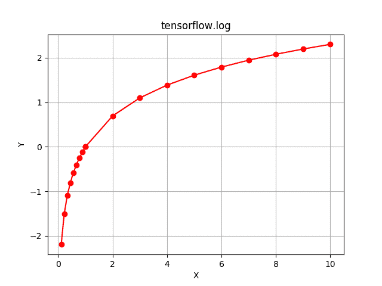

# Python | Tensorflow log()方法

> 原文:[https://www.geeksforgeeks.org/python-tensorflow-log-method/](https://www.geeksforgeeks.org/python-tensorflow-log-method/)

[Tensorflow](https://www.geeksforgeeks.org/introduction-to-tensorflow/) 是谷歌开发的开源机器学习库。其应用之一是开发深度神经网络。
模块 **tensorflow.math** 为许多基本的数学运算提供支持。函数 TF . log()[别名 tf.math.log]为 Tensorflow 中的*自然对数*函数提供支持。它期望以复数形式输入或浮点数。输入类型是张量，如果输入包含一个以上的元素，则计算元素对数，。

> **语法** : tf.log(x，name=None)或 tf.math.log(x，name=None)
> **参数**:
> **x**:bfloat 16、half、float32、float64、complex64 或 complex128 类型的张量。
> **名称**(可选):操作的名称。
> **返回类型**:与 x 相同大小和类型的张量。

**代码#1:**

## 蟒蛇 3

```py
# Importing the Tensorflow library
import tensorflow as tf

# A constant vector of size 5
a = tf.constant([-0.5, -0.1, 0, 0.1, 0.5], dtype = tf.float32)

# Applying the log function and
# storing the result in 'b'
b = tf.log(a, name ='log')

# Initiating a Tensorflow session
with tf.Session() as sess:
    print('Input type:', a)
    print('Input:', sess.run(a))
    print('Return type:', b)
    print('Output:', sess.run(b))
```

**输出:**

```py
Input type: Tensor("Const:0", shape=(5, ), dtype=float32)
Input: [-0.5 -0.1  0\.   0.1  0.5]
Return type: Tensor("log:0", shape=(5, ), dtype=float32)
Output: [       nan        nan       -inf -2.3025851 -0.6931472]
```

表示负值不存在自然对数，表示随着输入趋近于零，自然对数趋近于负无穷大。
**代码#2:** 可视化

## 蟒蛇 3

```py
# Importing the Tensorflow library
import tensorflow as tf

# Importing the NumPy library
import numpy as np

# Importing the matplotlib.pyplot function
import matplotlib.pyplot as plt

# A vector of size 20 with values from 0 to 1 and 1 to 10
a = np.append(np.linspace(0, 1, 10), np.linspace(1, 10, 10))

# Applying the logarithmic function and
# storing the result in 'b'
b = tf.log(a, name ='log')

# Initiating a Tensorflow session
with tf.Session() as sess:
    print('Input:', a)
    print('Output:', sess.run(b))
    plt.plot(a, sess.run(b), color = 'red', marker = "o")
    plt.title("tensorflow.abs")
    plt.xlabel("X")
    plt.ylabel("Y")
    plt.grid()

    plt.show()
```

**输出:**

```py
Input: [ 0\.          0.11111111  0.22222222  0.33333333  0.44444444  0.55555556
  0.66666667  0.77777778  0.88888889  1\.          1\.          2.
  3\.          4\.          5\.          6\.          7\.          8.
  9\.         10\.        ]
Output: [       -inf -2.19722458 -1.5040774  -1.09861229 -0.81093022 -0.58778666
 -0.40546511 -0.25131443 -0.11778304  0\.          0\.          0.69314718
  1.09861229  1.38629436  1.60943791  1.79175947  1.94591015  2.07944154
  2.19722458  2.30258509]
```

