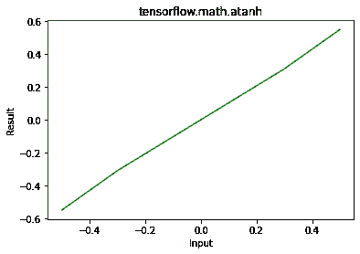

# python–tensorlow . math . atanh()

> 哎哎哎:# t0]https://www . geeksforgeeks . org/python-tensorlow-math-atanh/

[TensorFlow](https://www.geeksforgeeks.org/introduction-to-tensorflow/) 是谷歌为开发机器学习模型和深度学习神经网络而设计的开源 python 库。
**atanh()** 用来寻找 x 的元素智慧 atanh。

> **语法:** tf.math.atanh(x，name)
> 
> **参数:**
> 
> *   **x:** 是输入张量。这个张量允许的数据类型是 bfloat16，half，float32，float64。
> *   **名称(可选):**定义操作的名称。
>     
> 
> **返回:**返回与 x 相同数据类型的张量。

**例 1:**

## 蟒蛇 3

```
# Importing the library
import tensorflow as tf

# Initializing the input tensor
a = tf.constant([ -.5, -.3, 0, .3, .5], dtype = tf.float64)

# Printing the input tensor
print('Input: ', a)

# Calculating tanhgent
res = tf.math.atanh(x = a)

# Printing the result
print('Result: ', res)
```

**输出:**

```
Input:  tf.Tensor([-0.5 -0.3  0\.   0.3  0.5], shape=(5, ), dtype=float64)
Result:  tf.Tensor([-0.54930614 -0.3095196   0\.          0.3095196   0.54930614], shape=(5, ), dtype=float64)

```

**示例 2:** 可视化

## 蟒蛇 3

```
# Importing the libraray
import tensorflow as tf
import matplotlib.pyplot as plt

# Initializing the input tensor
a = tf.constant([-.5, -.3, 0, .3, .5], dtype = tf.float64)

# Calculating tanhgent
res = tf.math.atanh(x = a)

# Plotting the graph
plt.plot(a, res, color ='green')
plt.title('tensorflow.math.atanh')
plt.xlabel('Input')
plt.ylabel('Result')
plt.show()
```

**输出:**

