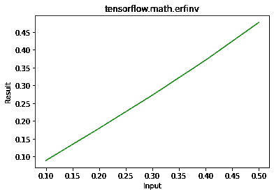

# python–tensorlow . math . erfinv()

> 哎哎哎:# t0]https://www . geeksforgeeks . org/python-tensorlow-math-erfinv/

[TensorFlow](https://www.geeksforgeeks.org/introduction-to-tensorflow/) 是谷歌为开发机器学习模型和深度学习神经网络而设计的开源 Python 库。

**erfinv()** 用于计算单元反误差函数。

> **语法:**tensorlow . math . erfinv(x，name)
> 
> **参数:**
> 
> *   **x:** 是输入张量。允许的数据类型有 bfloat16、half、float32、float64。
> *   **名称(可选):**定义操作的名称。
> 
> **返回:**返回与 x 相同数据类型的张量。

**例 1:**

## 蟒蛇 3

```py
# importing the library
import tensorflow as tf

# Initializing the input tensor
a = tf.constant([.1, .2, .3, .4, .5], dtype = tf.float64)

# Printing the input tensor
print('Input: ', a)

# Calculating inverse error
res = tf.math.erfinv(x = a)

# Printing the result
print('Result: ', res)
```

**输出:**

```py
Input:  tf.Tensor([0.1 0.2 0.3 0.4 0.5], shape=(5, ), dtype=float64)
Result:  tf.Tensor([0.08885599 0.17914345 0.27246271 0.37080716 0.47693628], shape=(5, ), dtype=float64)

```

**示例 2:** 可视化

## 蟒蛇 3

```py
# importing the library
import tensorflow as tf
import matplotlib.pyplot as plt

# Initializing the input tensor
a = tf.constant([.1, .2, .3, .4, .5], dtype = tf.float64)

# Calculating inverse error
res = tf.math.erfinv(x = a)

# Plotting the graph
plt.plot(a, res, color ='green')
plt.title('tensorflow.math.erfinv')
plt.xlabel('Input')
plt.ylabel('Result')
plt.show()
```

**输出:**

