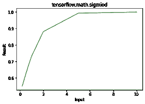

# Python–tensorflow . math . sigmoid()

> 原文:[https://www . geesforgeks . org/python-tensorflow-math-sigmoid/](https://www.geeksforgeeks.org/python-tensorflow-math-sigmoid/)

TensorFlow 是谷歌设计的开源 Python 库，用于开发机器学习模型和深度学习神经网络。

**sigmoid()** 用于寻找 x 的元素方向 sigmoid。

> **语法:** tensorflow.math.sigmoid(x，name)
> 
> **参数:**
> 
> *   **x:** 是张量。允许的数据类型有 float16、float32、float64、complex64 或 complex128。
> *   **名称(可选):**定义操作的名称。
> 
> **返回:**它返回一个与 x 相同数据类型的张量。

**例 1:**

## 蟒蛇 3

```
# importing the library
import tensorflow as tf

# Initializing the input tensor
a = tf.constant([.2, .5, .7, 1, 2, 5, 10], dtype = tf.float64)

# Printing the input tensor
print('a: ', a)

# Calculating result
res = tf.math.sigmoid(x = a)

# Printing the result
print('Result: ', res)
```

**输出:**

```
a:  tf.Tensor([ 0.2  0.5  0.7  1\.   2\.   5\.  10\. ], shape=(7, ), dtype=float64)
Result:  tf.Tensor(
[0.549834   0.62245933 0.66818777 0.73105858 0.88079708 0.99330715
 0.9999546 ], shape=(7, ), dtype=float64)

```

**示例 2:** 可视化

## 蟒蛇 3

```
# importing the library
import tensorflow as tf
import matplotlib.pyplot as plt

# Initializing the input tensor
a = tf.constant([.2, .5, .7, 1, 2, 5, 10], dtype = tf.float64)

# Calculating result
res = tf.math.sigmoid(x = a)

# Plotting the graph
plt.plot(a, res, color = 'green')
plt.title('tensorflow.math.sigmiod')
plt.xlabel('Input')
plt.ylabel('Result')
plt.show()
```

**输出:**

