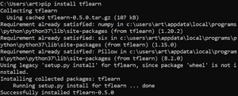
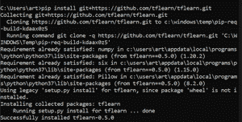

# t 学习及其在张量流中的安装

> 原文:[https://www . geesforgeks . org/TF learn-and-it-installation-in-tensorflow/](https://www.geeksforgeeks.org/tflearn-and-its-installation-in-tensorflow/)

**TFLearn** 可以描述为在 [Tensorflow 框架](https://www.geeksforgeeks.org/introduction-tensor-tensorflow/)之上创建的透明的模块化深度学习库。TFLearn 的主要目标是为 Tensorflow 提供更高级别的应用编程接口，以促进和加速实验，同时保持与它的完全兼容和透明。

## 特征

*   TFLearn 易于理解，是一个用户友好的高级 API，用于构建深度神经网络结构。
*   通过内置高兼容性的神经网络层，优化器，正则化器，度量等。它执行快速原型制作。
*   TFLearn 函数也可以独立使用，因为所有函数都建立在张量之上。
*   通过使用强大的辅助函数，任何接受多个输入、输出和优化器等的张量流图都可以很容易地被训练。
*   TFLearn 还可以用来创建华丽的图形可视化，其中包含关于梯度、权重、激活等的细节。毫不费力。
*   易于放置设备以利用多个中央处理器/图形处理器。

许多最近流行的深度学习网络体系结构，如卷积、残差网络、LSTM、PReLU、BatchNorm、生成网络等，都是由这个高级 API 支持的。

**注意:** TFLearn v0.5 仅兼容 TensorFlow 版本

## **通过执行以下命令安装 TFLearn:**

**稳定版:**

```
pip install tflearn
```



**最新版本:**

```
pip install git+https://github.com/tflearn/tflearn.git
```



## tflearn 示例:

通过下面给出的例子，演示了 TFLearn 回归的应用。

## 蟒蛇 3

```
# Importing tflearn library 
import tflearn
from tflearn.layers.conv import conv_2d, max_pool_2d, input_data
from tflearn.layers.core import dropout, fully_connected
from tflearn.layers.estimator import regression
import tflearn.datasets.mnist as mnist

# Extracting MNIST dataset & dividing into 
# training and validation dataset
x_train,y_train,x_test,y_test = mnist.load_data(one_hot=True)

# Reshaping dataset from (55000,784) to (55000,28,28,1) 
# using reshape
x_train = x_train.reshape([-1, 28, 28, 1])
x_test = x_test.reshape([-1, 28, 28, 1])

# Defining input shape (28,28,1) for network 
network = input_data(shape=[None, 28, 28, 1], name='input')

# Defining conv_2d layer 
# Shape: [None,28,28,32]
network = conv_2d(network, 32, 2, activation='relu')

# Defining max_pool_2d layer 
# Shape: [None,14,14,32]
network = max_pool_2d(network, 2)

# Defining conv_2d layer 
# Shape: [None,28,28,64]
network = conv_2d(network, 64, 2, activation='relu')

# Defining max_pool_2d layer 
# Shape: [None,7,7,64]
network = max_pool_2d(network, 2)

# Defining fully connected layer 
# Shape: [None,1024]
network = fully_connected(network, 512, activation='relu')

# Defining dropout layer 
# Shape: [None,1024]
network = dropout(network, 0.3)

# Defining fully connected layer
# Here 10 represents number of classes 
# Shape: [None,10]
network = fully_connected(network, 10, activation='softmax')

# Defining regression layer
# Passing last fully connected layer as parameter, 
# adam as optimizer, 
# 0.001 as learning rate, categorical_crossentropy as loss 
# Shape: [None,10]
network = regression(network, optimizer='adam', 
                     learning_rate=0.001, 
                     loss='categorical_crossentropy', 
                     name='targets')

# Passing network made as parameter
model = tflearn.DNN(network)

# Fitting the model with training set:{x_train, y_train} 
# testing set:{x_test, y_test}
model.fit({'input': x_test}, {'targets': y_test}, 
          n_epoch=10, 
          snapshot_step=500, run_id='mnist',
        validation_set=({'input': x_test}, {'targets': y_test}), 
        show_metric=True)
```

**输出:**


**说明:**

为了使用 tflearn 实现分类器，第一步是导入 tflearn 库和子模块，如 conv(用于卷积层)、核心(用于缺失和完全连接层)、估计器(用于应用线性或逻辑回归)和数据集(用于访问 MNIST、CIFAR10 等数据集)。)

使用 load_data，提取 MNIST 数据集，并将其分成训练集和验证集，输入 x 具有形状(样本，784)。现在，为了使用输入 x 进行训练，我们使用将它从(样本，784)重塑为(样本，28，28，1)。重塑(新形状)。之后，我们为网络定义相同的新形状。现在，为了定义网络模型，我们将几个卷积 2d 层和 max _ pooling2d 层堆叠在一起，然后是堆叠的脱离层和完全连接层。